# GalChat

GalChat 是一个面向角色聊天、多人互动和 CoC 跑团的全栈项目。用户可以创建或导入世界，与角色单独聊天、组织群聊，也可以选择模组，由 KP（主持人）和调查员共同推进跑团。聊天记忆、角色好感、行动轮、掷骰结果和存档共同构成可持续恢复的游戏状态。

后端基于 Java 21、Spring Boot 和 Spring AI；前端位于 `reka/`，使用 Vue 3、TypeScript、Reka UI 和 Three.js。`python/` 提供输入完整性判断、检索重排和角色卡 PDF 工具。

## 功能介绍

### GalChat 1.1｜和熟悉的角色，开始一场 CoC 冒险

在 GalChat，你可以建立自己的世界，与角色聊天，也可以邀请他们一起调查线索、面对危险，再在冒险结束后聊聊刚才发生的事。1.1 加入了完整的 CoC（《克苏鲁的呼唤》）跑团流程、多人群聊、自选模型和新版手机界面，让日常交流与共同冒险连接起来。下面从开始跑团讲起，介绍当前版本的主要功能与用法。

文中跑团演示使用模组《太阳与九英镑》，作者 Gnk，模组著作权归原作者所有。演示包含部分剧情内容。

**1 · 开始 CoC 跑团，选择这一次的冒险**

在“新建群聊或跑团”中选择跑团，选定模组和同行角色，再为调查员准备人物卡，即可由 AI KP（主持人）带领进入故事。你可以邀请多位 AI 同伴，也可以独自开始，由你与 KP 推进调查。跑团中的地点、行动、检定与战斗会在同一个会话中展开。

**2 · 同行档案，看看你们走过的旅程**

选择 AI 同伴时，点击角色即可查看同行档案，包括最近参团状态、已完成次数和历史完成记录，再勾选想邀请的角色。这里的“已完成”对应已生成完成报告并归档的跑团，直接关闭会话不会计入。再次开团时，可以先看看谁陪你经历过哪些故事，再决定这次的队伍。

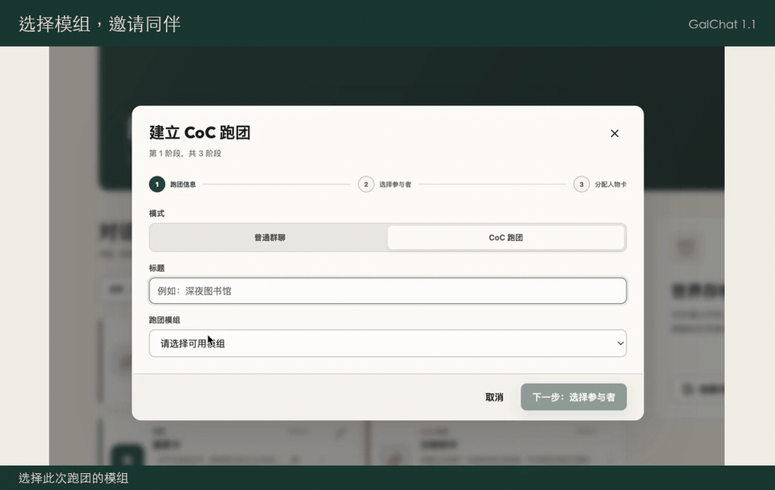

**3 · 分步创建人物卡，亲手决定调查员的样子**

在人物卡绑定窗口选择“标准步进建卡”，按步骤填写身份、掷出属性、处理年龄调整、选择职业、分配技能，并完善背景和装备。建卡草稿会保存进度，中途退出后可以继续。完成后检查人物卡，再确认绑定；你的调查员使用分步建卡或文本导入，AI 同伴也可以使用分步建卡。

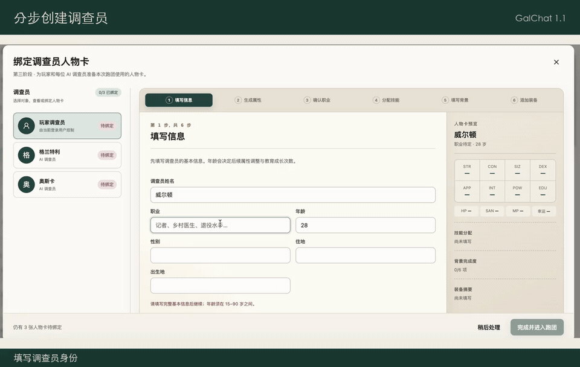

**4 · 自动建卡，为 AI 同伴准备身份**

为 AI 调查员选择自动生成后，系统会参考角色设定和当前模组生成属性、技能、背景与装备，并展示相关骰点。生成后可以先查看整张人物卡，不满意时选择完整重新生成，或仅重骰并重写背景，确认后才会绑定。这项功能只对 AI 调查员开放，适合希望尽快带熟悉角色进入模组的玩家。

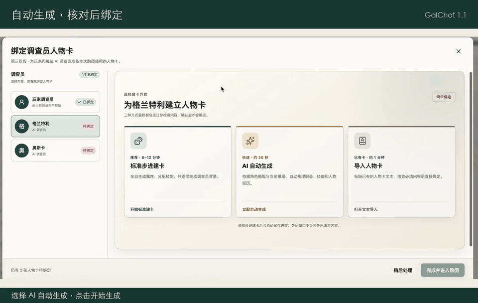

**5 · 导入现成人物卡，继续使用熟悉的调查员**

在绑定窗口选择“导入人物卡”，粘贴已有的 CoC 人物卡文本，页面会预览识别结果并提示缺少的必填内容。也可以下载提供的表格模板，用 Excel 或 WPS 完成建卡，再从“txt输出”复制文本粘贴到页面；当前导入入口接收文本，不直接上传 XLSX 文件。核对姓名、职业、年龄、属性等信息后，点击“导入并绑定人物卡”，全部调查员就位后进入跑团。

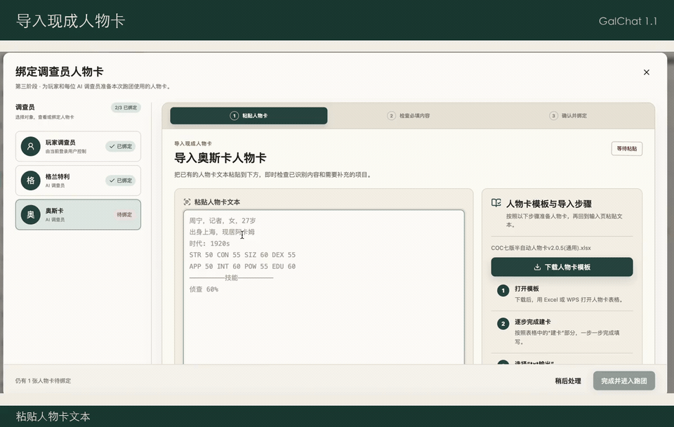

**6 · 选景与探索，决定接下来调查什么**

进入跑团后，根据模组提供的场景选择目的地，再用自然语言描述行动，例如“查看壁炉里的灰烬”或“询问店主昨晚见过谁”。KP 会根据现场情况回应，必要时要求补充行动细节或发起检定；想先弄清可观察到的信息时，可使用“询问 KP”。完成当前地点的调查后，点击“结束探索”，让故事进入后续阶段。

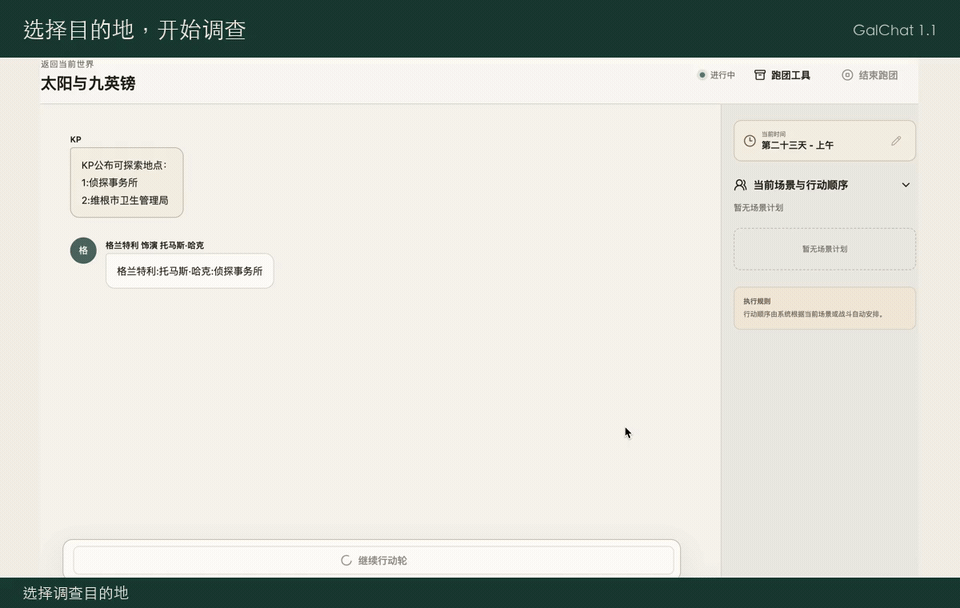

**7 · 子场景与展示材料，把调查继续深入**

探索过程中，KP 可以根据当前地点安排更细的子场景，让调查深入房间、建筑内部或其他局部区域；“场景与队伍”会显示当前场景、关联场景和行动顺序。模组中的信件、图片等展示材料也可以随剧情出现在聊天里，直接查看后再决定下一步。界面同时显示游戏内时间，便于理解故事的先后进程。

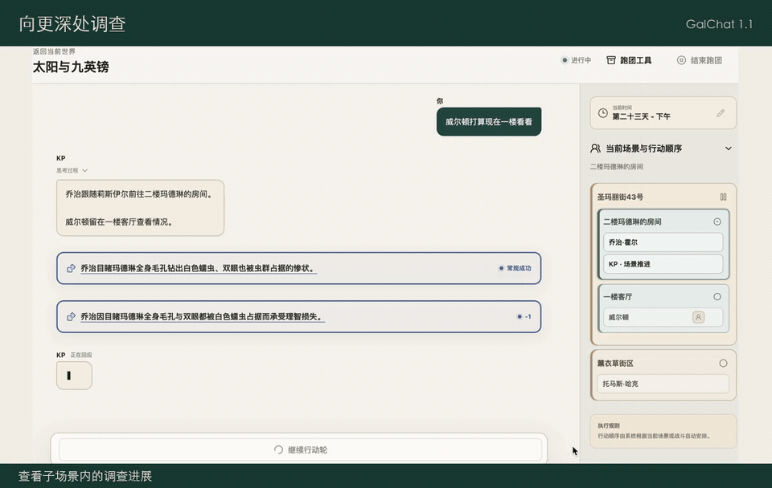

**8 · 行动轮与角色控制，按自己的节奏推进**

跑团会显示当前行动轮及正在执行的步骤，轮到你时提交行动，等待继续时使用推进按钮，执行失败时可重试对应步骤。在“跑团工具 → 状态”中，可以为 AI 同伴切换回复模型，或改为手动控制并代其输入行动；KP 始终由 AI 控制，可以单独选择模型。这样既能与同伴一起冒险，也能亲自掌握更多调查员的决定。

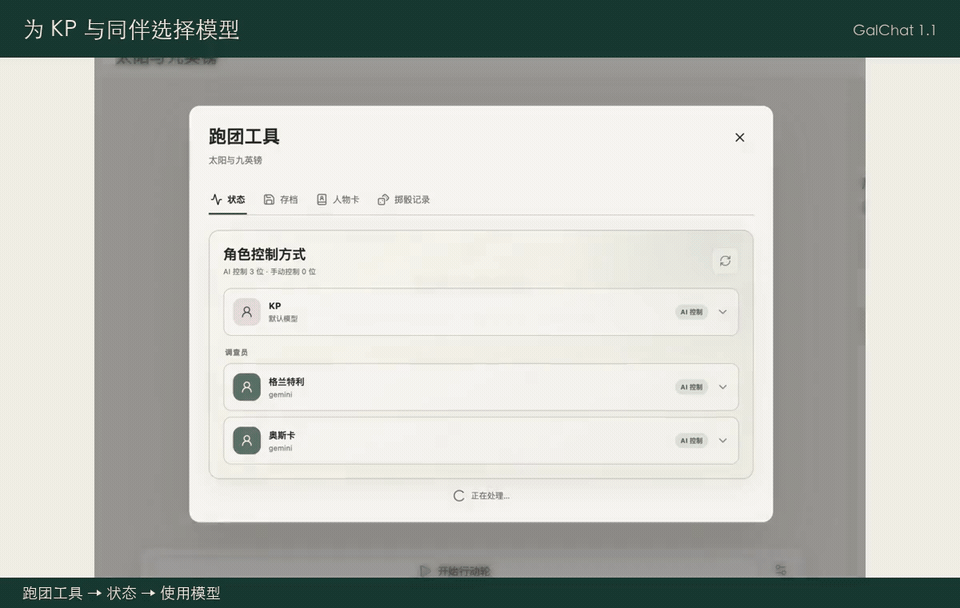

**9 · 3D 掷骰，让关键检定发生在眼前**

当行动需要检定时，系统会展示可操作的 3D 骰盘，完成掷骰后显示点数与结算结果。技能检定、理智检定、理智损失和战斗伤害等骰点会随实际流程出现，相关角色状态也会更新。检定支持奖励骰、惩罚骰及适用情形下的孤注一掷等处理；想更换骰子的外观，可在“账号资料”中选择骰子皮肤。

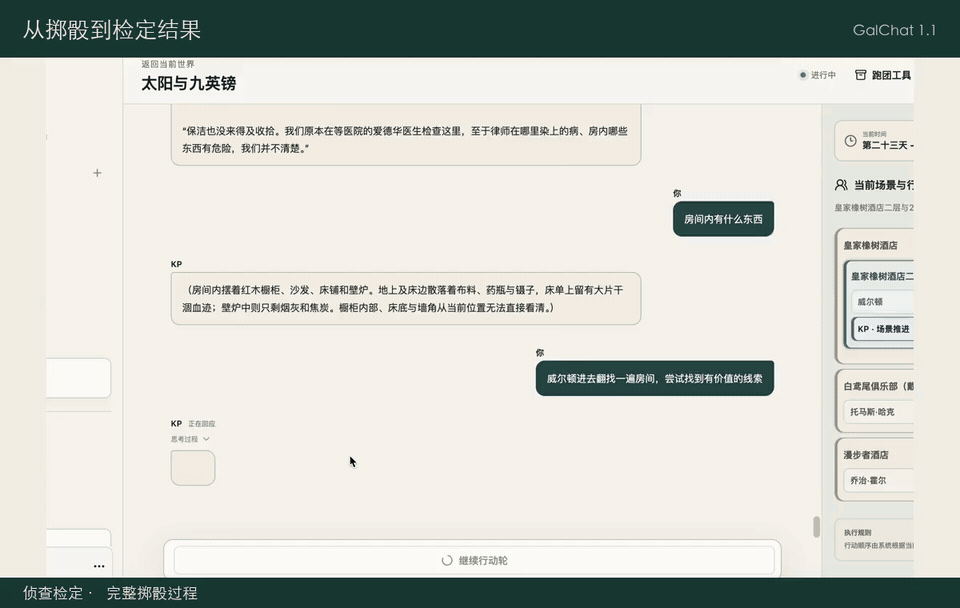

**10 · 战斗与装备，让行动落实到角色状态**

战斗按“攻击者声明行动 → 防守者声明行动（可选）→ 掷骰裁定”的顺序进行。攻击者先说明目标与意图，例如“瞄准敌人开枪”；需要防守方回应时，再由防守者声明行动，随后按提示掷骰，由系统裁定攻击结果与伤害。系统提供近战、枪械和伤害等结算，更新相关角色状态，并展示战斗概览及结果。武器和随身装备可在人物卡中查看，获取、购买或丢弃物品时，也可以通过行动向 KP 说明，由剧情和规则共同决定结果。

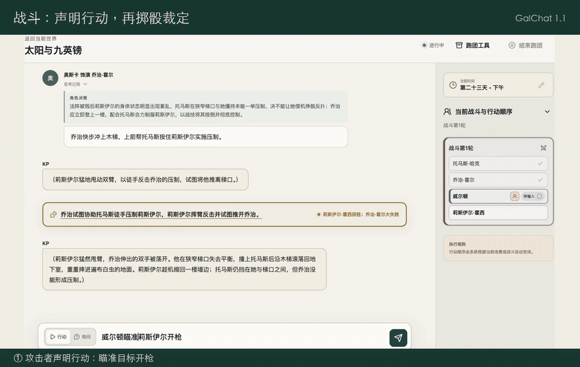

**11 · 人物卡与掷骰记录，随时翻开调查档案**

打开“跑团工具 → 人物卡”，选择调查员即可查看属性、技能、武器、装备、背景和笔记；技能支持搜索与排序，方便快速找到需要的数据。“掷骰记录”会汇集当前会话中的骰点，可以按名称和类别筛选，检查之前的检定结果。无论是确认自己的侦查数值，还是回看一次关键失败，都可以在这里找到依据。

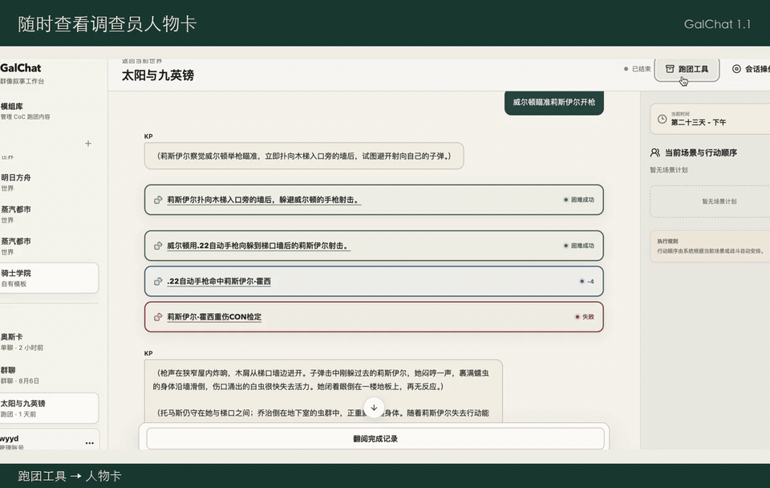

**12 · 人物卡 PDF，把调查员带到纸面上**

在已启用 PDF 导出服务的站点，人物卡页面提供导出入口，选择“1920 年代”或“现代”卡面，再选择字体，即可生成并下载双页 PDF，适合保存或打印。PDF 使用固定卡面容量，超出位置的内容会省略；它用于展示与打印，完整跑团状态仍通过跑团存档保留。

**13 · 跑团存档与回退，保留重要的分岔点**

在“跑团工具 → 存档”中保存当前进度、填写备注，之后可预览并读取；系统还提供行动轮、场景和初始状态的自动回退点。恢复前会展示对应位置及影响范围，确认后，消息、骰点、人物状态和行动进度会一并回到那个时刻。适合中途暂停、重新尝试某个决定，或在继续长篇调查前保留进度。

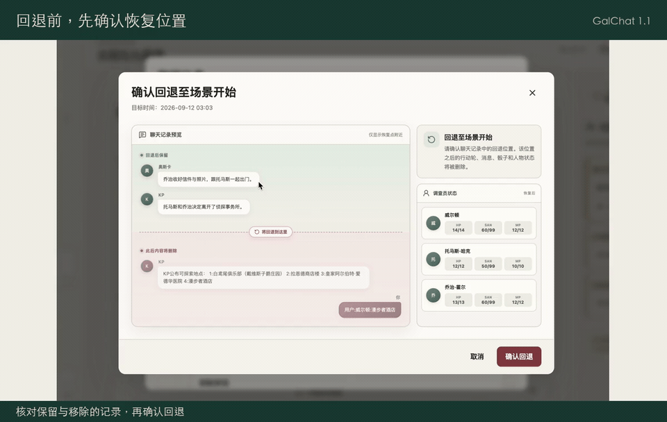

**14 · 跑团中的单聊，听听同伴自己的想法**

想和某位同伴单独交流时，可以返回世界的对话中心，打开这位角色的单聊，问问他对刚才线索的看法，或聊聊某次冒险中的决定。角色可以查找自己在当前世界参与过的跑团及相关经历，交流后再返回跑团会话继续。提到模组名或具体事件，有助于角色找到你想谈的那段记录。

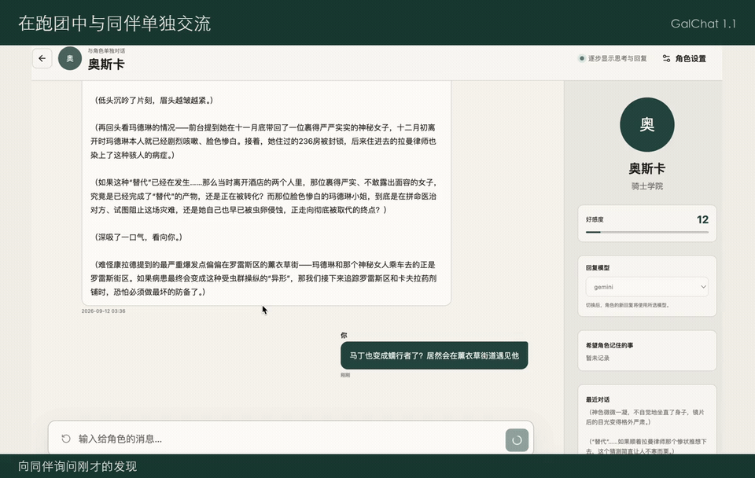

**15 · 完成报告，回看你们共同经历的故事**

当剧情进入收尾阶段，完成最终场景后选择“生成跑团总结并归档”，即可得到包含跑团概览、共同旅程、调查员后传、掷骰回顾与战斗回顾的完成报告。你可以展开场景摘要、查看调查员最终状态与 HP / SAN 变化，回顾关键检定和战斗。生成失败时可以重试；选择直接结束或跳过总结则不会生成报告。

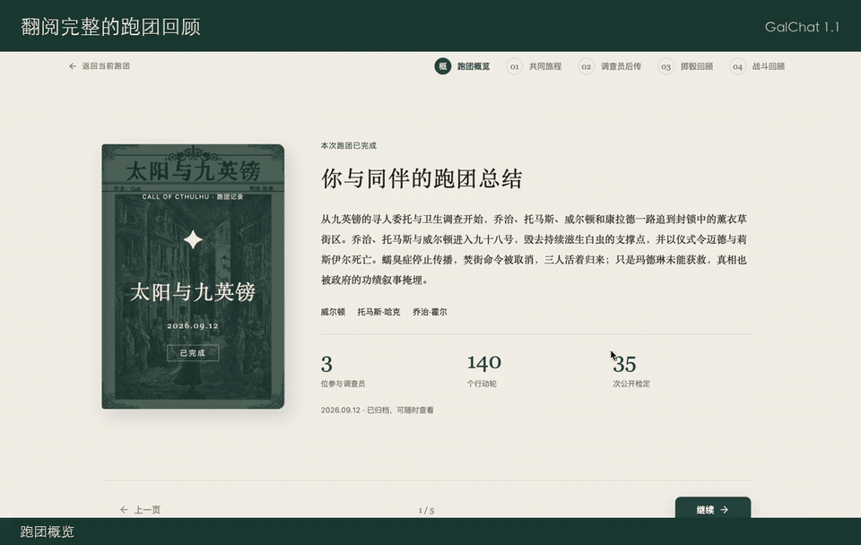

**16 · 冒险之后，仍然可以继续交流**

跑团归档后，仍可打开会话重读记录与完成报告，也可以回到角色单聊或邀请角色群聊，聊聊这次经历中最惊险、最遗憾或最难忘的片段。角色能够按需查找自己参与过的跑团记录，让“那次我们一起做过的事”成为后续交流的话题；想开始下一次冒险时，再创建新跑团、选择同伴和模组即可。

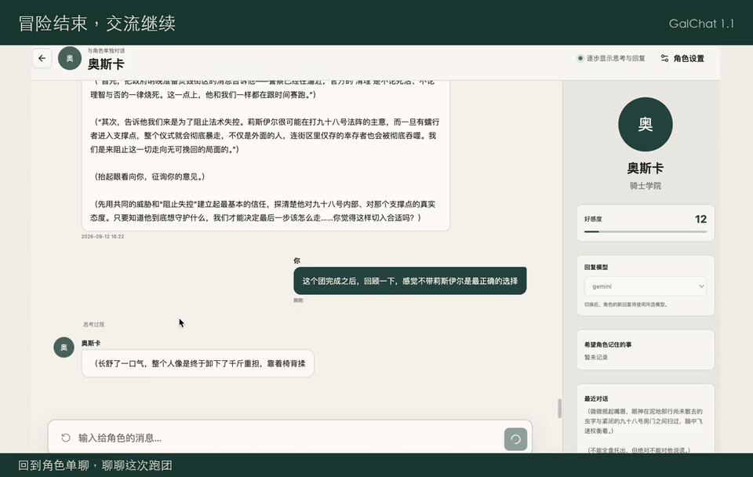

**17 · 模组库，准备属于自己的调查故事**

从侧栏或手机底部导航进入“模组库”，可以查看现有模组，也可以创建或导入 JSON 模组，维护基本信息、地点、线索、展示材料及模组人物。自己的模组支持导出，方便备份和分享；系统模组只读，已被跑团引用的个人模组会限制部分编辑。准备好内容后，就能在新建跑团时选择它。

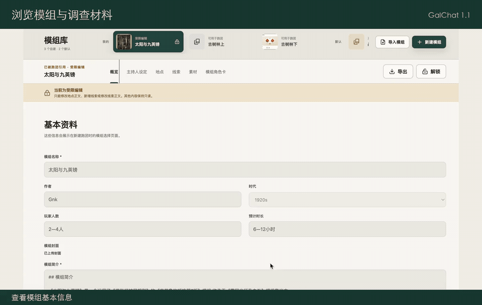

**18 · 自选模型，为不同角色选择回复方式**

打开账号菜单或手机“我的”页面中的“模型管理”，填写 OpenAI 兼容服务的 API 地址、模型名称和 API Key，也可以从 cURL 导入连接；保存后运行测试，查看基础对话、流式输出和工具调用能力。随后可在单聊角色详情、群聊参与者设置或跑团工具中分别选择模型，KP 也能单独配置；不选择时使用默认模型。当前自定义地址支持公网 HTTPS 接口。

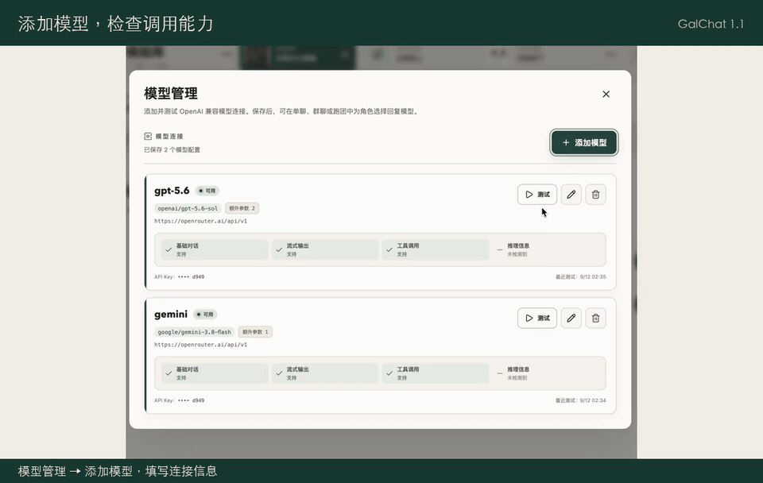

**19 · 实验功能，尝试更连续的跑团节奏**

在“行动轮设置”中开启“自动推进”，系统会在行动轮之间及非用户掷骰后倒计时继续；需要亲自输入或操作时，仍由你接手。“修正方向”可以给下一轮 AI 调查员补充临时探索或战斗倾向，例如“优先确认撤退路线”。这些设置仅在当前页面生效，刷新后重置；同处还可设置是否自动展开 KP 思考，思考内容可能包含隐藏剧情，默认关闭。

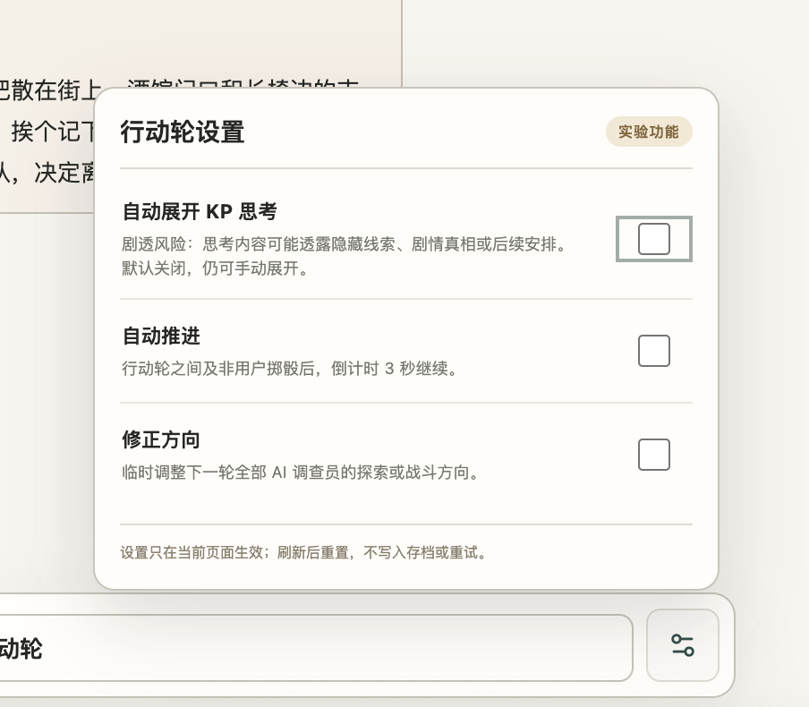

**20 · 新版手机界面，在小屏幕上继续故事**

手机端以“世界、模组、我的”为主要导航，将角色详情、人物卡、跑团工具、存档预览和模型管理整理成适合小屏幕阅读与操作的页面。打开同一站点并登录账号后，可以进入已有世界与会话继续查看和操作；在世界的“对话中心”按单聊、群聊或跑团筛选，也能更快回到想继续的故事。

**21 · 账号与偏好，管理自己的使用设置**

在桌面端账号菜单或手机“我的”页面，可以查看和修改账号资料、选择骰子皮肤，并通过邮箱验证码修改密码。初次使用时完成注册与登录，再创建世界即可开始；常用的模型配置也从这里统一管理。

**四种骰子皮肤，同一次检定。**

经典、星穹、月白冰晶与朱砂鎏金，你更喜欢哪一种？在“账号资料”中选择并保存，之后新打开的掷骰动画就会使用对应皮肤。

[观看四种骰子皮肤演示](output/video/article-media/17-dice-skins.mp4)

从一次对话，到一场冒险，再到冒险之后的下一次相约。

**GalChat 1.1，下一次，仍与你同行。**

## 技术栈

以下版本以仓库中的 `pom.xml` 和 `reka/package.json` 为准。

| 模块 | 技术 |
| --- | --- |
| 后端 | Java 21、Spring Boot 4.0.5、Spring AI 2.0.1、MyBatis-Plus |
| AI | DeepSeek、OpenAI 兼容 API、Ollama Embedding、Spring AI Tool Calling |
| 数据与并发 | PostgreSQL、pgvector、Redis、Redisson |
| 前端 | Vue 3.5、TypeScript 6、Vite 8、Reka UI 2、Three.js |
| Python 辅助服务 | FastAPI、PyTorch、Transformers、jieba |
| 文件与邮件 | Aliyun OSS、Aliyun Direct Mail |

## 项目结构

```text
.
├── pom.xml
├── mvnw / mvnw.cmd
├── src/main/java/com/me/galchat/
│   ├── controller/             # REST API 和 SSE 入口
│   ├── service/impl/
│   │   ├── character/          # 角色模板、角色卡、自动与分步创建
│   │   ├── chat/               # 单聊及本地 NLP 服务适配
│   │   ├── dice/               # 掷骰、CoC 检定与战斗规则
│   │   ├── group/              # 群聊、发言计划、生成流与执行恢复
│   │   ├── trpg/               # 模组、场景、行动轮、战斗与跑团存档
│   │   ├── user/               # 用户、历史、好感与用户事件
│   │   └── world/              # 世界模板、用户世界、世界归档与存档
│   ├── groupchat/              # 群聊 / 跑团运行策略、上下文、工具记录
│   ├── singlechat/             # 单聊客户端组装
│   ├── modelapi/               # 自定义模型配置、加密、探测与运行时
│   ├── memory/                 # 单聊记忆、话题窗口与消息聚合
│   ├── vector/                 # 世界详情、聊天、群聊话题、跑团行动检索
│   ├── tool/                   # 好感、KP、调查员等模型工具
│   ├── domain/                 # PO / DTO / VO
│   ├── mapper/                 # MyBatis Mapper
│   ├── websocket/              # WebSocket 入口
│   ├── consumer/               # 队列消费者
│   ├── task/                   # 定时任务
│   └── config/                 # Web、AI、Redis、向量库等配置
├── src/main/resources/
│   ├── application.yaml
│   └── mapper/                 # SQL 映射
├── src/test/java/com/me/galchat/
│   └── init/console.sql        # 空数据库的完整建表与技能种子脚本
├── reka/
│   ├── public/templates/      # 可下载的人物卡表格模板
│   ├── src/api/                # 请求客户端与接口类型
│   ├── src/components/         # 世界、单聊、群聊、跑团、角色卡等界面
│   ├── src/dice/               # 骰子展示与播放逻辑
│   └── test/                   # 前端测试；部分测试与源文件同目录
├── python/
│   ├── bert.py                # 输入完整性判断，localhost:8081
│   ├── reranker_server.py     # 检索重排，localhost:8082
│   ├── character_card_pdf.py  # 角色卡 PDF 服务（渲染、接口、启动）
│   └── character_card/        # 字体、模板与字体许可证
├── data/
│   ├── worlds/                # 世界 JSON 数据
│   └── modules/               # 模组 SQL / JSON 数据
├── dice/                      # 骰子 Blender 源文件
└── output/                    # 规则资料、转换结果及素材输出
```

## 环境与配置

- JDK 21；仓库提供 Maven Wrapper。
- Node.js 满足 `^20.19.0 || >=22.12.0`，用于前端开发和构建。
- PostgreSQL，并安装 pgvector 扩展；Redis。
- Ollama 和 1024 维 embedding 模型，当前配置为 `bge-m3`。
- 可用的 DeepSeek API 配置，用于内置聊天及辅助生成流程。
- Python 3.10+，仅在运行 Python 辅助服务或角色卡 PDF 工具时需要。
- 图片上传和邮箱验证码需要相应的 Aliyun OSS / Direct Mail 配置与凭据。

后端配置入口为 [application.yaml](src/main/resources/application.yaml)。按实际环境设置以下配置：

| 配置项 | 用途 |
| --- | --- |
| `spring.datasource.url` / `username` / `password` | PostgreSQL 连接 |
| `spring.data.redis.*` | Redis 连接 |
| `spring.ai.deepseek.base-url` / `api-key` / `chat.model` | 内置模型服务与模型名 |
| `spring.ai.ollama.base-url` / `embedding.model` | Ollama 地址与 embedding 模型 |
| `galchat.model-api.master-key` | 加密用户自定义模型 API Key 的主密钥 |
| `galchat.model-api.request-timeout` | 自定义模型请求超时，当前为 `120s` |
| `galchat.alioss.*` / `galchat.aliemail.*` | OSS 与邮件业务配置；OSS 使用环境变量凭据，邮件使用阿里云默认凭据链 |

主密钥必须是 **32 字节随机数据的 Base64 编码**。首次部署时可用 `openssl rand -base64 32` 生成，并通过外部配置持久保存；配置读取也支持 `GALCHAT_MODEL_API_MASTER_KEY` 作为回退值。已有加密数据需要同一把密钥才能解密。数据库连接、API Key 等敏感值请使用环境变量或外部配置覆盖。

## 快速启动

以下命令除前端步骤外，均在仓库根目录执行。

### 1. 初始化空数据库

创建 PostgreSQL 数据库后执行：

```bash
psql -h localhost -U <username> -d <database> -v ON_ERROR_STOP=1 \
  -f src/test/java/com/me/galchat/init/console.sql
```

`console.sql` 一次性建立当前全部 47 张业务表（含 `trpg_completion`）、业务索引和 CoC 技能定义种子数据，并安装 `vector` 扩展，无需额外维护脚本。该脚本面向空数据库，不是已有数据库的增量升级脚本。以下四张向量表及其索引由后端启动时通过 `VectorConfiguration` 的 Spring AI 自动初始化，使用 UUID 主键、1024 维向量及 HNSW 余弦索引：

- `world_detail_vector_store`
- `chat_history_vector_store`
- `group_topic_vector_store`
- `trpg_turn_vector_store`

如果需要示例跑团模组，可在建表后单独执行：

```bash
psql -h localhost -U <username> -d <database> -v ON_ERROR_STOP=1 \
  -f data/modules/15-01-amidst-the-ancient-trees.sql
```

该脚本导入《古树林中》，重复导入会报错。`data/modules/00-debug-combat-arena.sql` 用于战斗调试。世界 JSON 可通过前端导入。

《太阳与九英镑》提供[个人模组导入 JSON](data/modules/sun-and-nine-pounds.json) 和[系统默认模组 SQL](data/modules/sun-and-nine-pounds.sql)，两种方式任选其一。该模组按可回访的地点网络组织，保留场景原文并补充 AI 主持说明；封面与 10 份展示材料已填写上传地址。

模组与用户世界数据按需导入，不随建表自动创建。《古树林中》的当前导入 SQL 已包含七个时间场景及最终场景主持说明。历史武器修正和跑团重置属于旧数据维护，不参与空库初始化。已有数据库升级需备份后对照当前结构处理，不要重跑 `console.sql`。

### 2. 准备 Redis、Ollama 和后端配置

启动 Redis 与 Ollama，拉取 embedding 模型：

```bash
ollama pull bge-m3
```

按上一节设置数据库、Redis、DeepSeek 等配置。如果更换 embedding 模型，必须同时核对 `VectorConfiguration` 中的 `dimensions(1024)` 和已有向量表结构。

### 3. 启动后端

macOS / Linux：

```bash
./mvnw spring-boot:run
```

Windows：

```powershell
.\mvnw.cmd spring-boot:run
```

默认 HTTP 地址为 `http://localhost:8080`，WebSocket 路径为 `/ws/{sid}`。Actuator 健康检查路径为 `/actuator/health`；当前鉴权拦截器未豁免该路径，需要携带 `token`。

### 4. 启动前端

```bash
cd reka
npm ci
npm run dev
```

默认开发地址为 `http://localhost:5173`。`reka/vite.config.ts` 将 `/api` 请求转发到后端并移除 `/api` 前缀，将 `/ws` 转发到后端 WebSocket 服务。

登录后可导入或创建世界、添加角色并开始单聊或群聊；跑团需要选择模组、配置参与者和角色卡，再开始行动轮。

### 5. 可选：启动 Python 辅助服务

```bash
python -m pip install fastapi uvicorn torch "transformers>=4.36.0" pydantic jieba
```

输入完整性判断服务需要事先在 `python/bert_model/` 放置可加载的分类模型与 tokenizer；该模型不随 Git 仓库提供。

```bash
python python/bert.py
```

检索重排服务默认加载 `Alibaba-NLP/gte-multilingual-reranker-base`，首次启动可能需要下载模型：

```bash
python python/reranker_server.py
```

也可以指定本地模型目录：

```bash
RERANKER_MODEL_PATH=/path/to/gte-multilingual-reranker-base python python/reranker_server.py
```

reranker 还支持 `RERANKER_DEVICE`、`RERANKER_MAX_LENGTH`、`RERANKER_BATCH_SIZE` 和 `RERANKER_TORCH_DTYPE`。Java 当前直接调用本机 `8081` 和 `8082`；异机部署需要调整 Java 侧地址。

这两个服务调用失败时，BERT 判断会使用延迟任务兜底，reranker 会保留原始向量召回顺序，可先不启动它们来验证主流程。

### 可选：生成角色卡 PDF

在「跑团工具 → 人物卡」右上角导出 PDF。前端直接调用可选 Python 服务，服务不可用时隐藏按钮。全部代码位于 `python/character_card_pdf.py`，所需字体和模板位于同级 `character_card/` 文件夹。

```bash
python -m pip install Pillow reportlab fastapi uvicorn
python python/character_card_pdf.py
```

默认监听 `127.0.0.1:8083`，可通过 `--host`、`--port` 调整。在 `reka/.env.local` 中配置 `VITE_CHARACTER_CARD_PDF_URL=http://127.0.0.1:8083` 后重启前端。生产构建前须使用浏览器可访问的 HTTPS 服务地址或同域代理路径；跨域时通过 `CHARACTER_CARD_ALLOWED_ORIGINS` 设置允许的前端来源（逗号分隔，默认允许 `http://localhost:5173` 和 `http://127.0.0.1:5173`）。

`GET /health` 检查资源是否齐全；`POST /export` 接收人物卡 `card`、模板 `background`（`1920s` / `modern`）和字体 `fontIndex`（0 / 1 / 2），返回固定双页 PDF。前端提交当前查看的人物卡，不携带主系统 token 或 cookies；头像由浏览器转为内嵌图片，读取失败时提示并导出无头像版本。技能仅填写当前值与基础值不同的项目（包括降低后的值）；专攻优先填写所属大类的空位，放不下再使用右下角 5 个通用空位，其余舍弃。背景和装备按可用行数换行，超过容量的内容截断，不增加补充页。武器区保留徒手战斗首行及另外 5 行，不包含调查员笔记等模板没有对应位置的资料，用于打印而非完整数据备份。

## 主要接口

下表路径均为后端路径。通过 Vite 代理访问时加 `/api` 前缀。除登录、注册和注册邮箱验证码外，HTTP 请求默认需要携带 `token` 请求头；SSE 接口返回事件流，其余大部分接口返回 `Result` 包装的数据。

| 模块 | 主要路径 |
| --- | --- |
| 用户 | `/user/login`、`/user/register`、`/user/register/email-code`、`/user/info`、`/user/password`、`/user/password/email-code` |
| 世界与角色 | `/world/**`、`/character/**` |
| 单聊与历史 | `POST /ai/chat`、`GET /history`、`POST /history/withdraw` |
| 单聊模型绑定 | `PUT /character/{userWorldId}/{characterId}/model` |
| 世界存档 | `GET/POST /world-saves/{userWorldId}`、`POST /world-saves/{userWorldId}/load` |
| 模型 API | `GET/POST /model-apis`、`PUT/DELETE /model-apis/{id}`、`POST /model-apis/{id}/test` |
| 群聊会话 | `GET/POST /group-chat/conversations`、`GET/DELETE /group-chat/conversations/{conversationId}` |
| 关闭会话 | `POST /group-chat/conversations/{conversationId}/close`（手动关闭，不生成完成报告） |
| 同行档案 | `GET /group-chat/participant-history?userWorldId=…`、`GET /group-chat/participant-history/{characterId}/runs?userWorldId=…`（完成记录支持 `cursor`、`limit` 分页） |
| 跑团完成报告 | `GET /group-chat/conversations/{conversationId}/completion-report` |
| 群聊消息 | `GET/POST /group-chat/conversations/{conversationId}/messages`、`POST /group-chat/conversations/{conversationId}/withdraw` |
| 生成流恢复 | `GET /group-chat/conversations/{conversationId}/generations/{clientRequestId}` |
| 参与者与计划 | `/group-chat/conversations/{conversationId}/actor-runtimes`、`/group-chat/conversations/{conversationId}/reply-plan` |
| 模组 | `/coc-modules/**`，含 `/import` 和 `/{id}/export` |
| 角色卡 | `/character-cards/**`、`/character-card-creation/drafts/**` |
| 跑团执行 | `/group-chat/conversations/{conversationId}/turns/**` |
| 跑团状态 | `/group-chat/conversations/{conversationId}/context-window`、`/game-time`、`/combat-overview`（后两项使用相同会话前缀） |
| 掷骰 | `GET /dice-rolls/{id}`、`GET /dice-rolls/{id}/results`、`POST /dice-roll-results/{id}/roll` |
| 跑团存档 | `GET/POST /trpg-saves/{conversationId}`、`POST /trpg-saves/{conversationId}/load` |
| 跑团回滚 | `GET /trpg-saves/{conversationId}/rollback-status`；`POST` 同前缀下的 `/rollback-turn`、`/rollback-scene`、`/rollback-initial` |
| 图片与实时连接 | `POST /upload`、WebSocket `/ws/{sid}` |

完整请求字段与响应结构以 `src/main/java/com/me/galchat/controller/`、`domain/dto/`、`domain/vo/` 和 `reka/src/api/` 为准。

## 开发与验证

后端测试与打包：

```bash
./mvnw test
./mvnw clean package
```

仓库同时包含单元测试和依赖数据库、应用上下文或外部服务的集成测试，运行全部测试前需准备相应环境。仅需验证编译与打包时：

```bash
./mvnw clean package -DskipTests
```

前端测试、类型检查和构建：

```bash
cd reka
npm test
npm run type-check
npm run build
```

`npm run build` 已包含类型检查；前端测试直接使用 Node 的测试运行器执行 TypeScript 文件，需要使用支持直接运行 TypeScript 的 Node 版本。`npm run preview` 可预览构建产物；部署时需配置 `/api`、`/ws` 后端路由，并支持 WebSocket 和 SSE 长连接。
