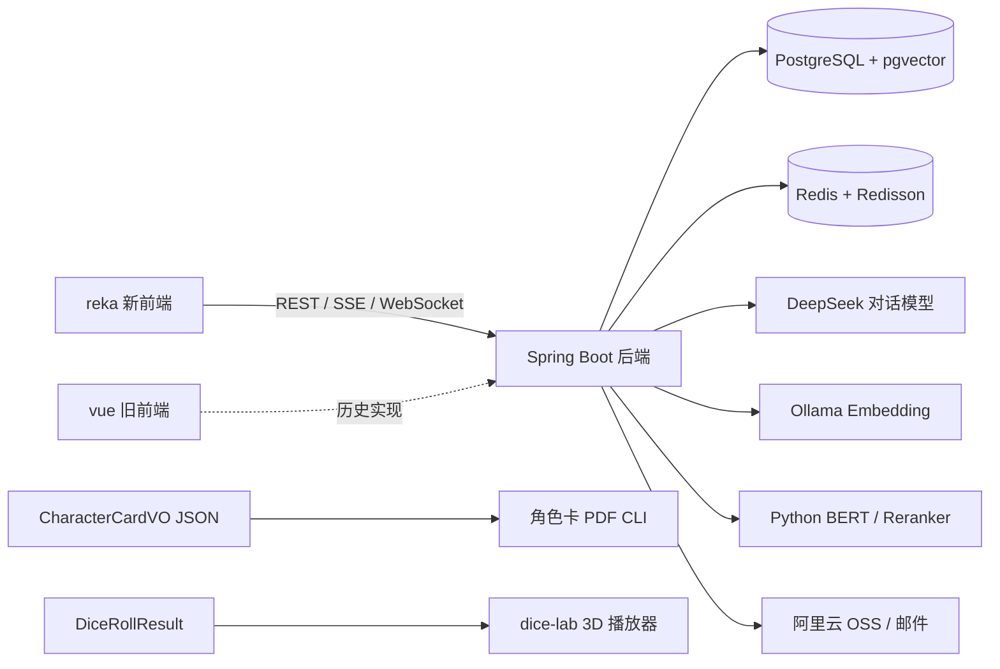

# GalChat 已完成开发模块说明

> 基线：`main` 分支，提交 `74cc8e0`（群聊与新版前端）
>
> 盘点日期：2026-07-16
>
> 文档口径：以当前源码、接口、数据库脚本、自动化测试和可复现构建为准。仅存在于设计稿、旧前端或静态资产中的内容，不计入当前主线的已完成功能。

## 1. 项目定位

GalChat 是一个面向角色聊天、持续世界状态和 TRPG 场景扩展的全栈项目。当前主线已经形成以下能力闭环：

1. 用户可以注册登录、创建或导入世界，并管理世界设定与角色。
2. 用户可以与单个角色进行流式对话，系统会维护话题边界、长期记忆、角色好感和用户事件。
3. 群聊后端已经支持多角色串行回复、回复计划、关闭摘要和检索归档；新版前端已接入主要交互，但关闭接口仍待对齐。
4. 用户可以保存和读取世界快照，也可以撤回上一轮单聊并回滚相关副作用。
5. 项目已具备 CoC 角色卡导入、幸运骰、角色卡 PDF 输出和 3D 骰子结果播放等独立能力。

当前推荐的应用入口为 [`reka/`](../reka/)。[`vue/`](../vue/) 是上一版前端，仍保留较完整的历史功能，但没有接入新版群聊，且仍引用已删除的故事事件接口。

## 2. 当前架构

主要技术栈：

| 层级 | 当前实现 |
| --- | --- |
| 后端 | Java 21、Spring Boot 4.0.5、Spring AI 2.0.0-M4、MyBatis-Plus |
| AI | DeepSeek thinking/non-thinking、Spring AI Tool Calling、Ollama `bge-m3` |
| 数据 | PostgreSQL、pgvector、Redis、Redisson |
| 主前端 | Vue 3、TypeScript、Vite、Reka UI、Lucide |
| 辅助服务 | FastAPI、PyTorch、Transformers、jieba |
| 离线工具 | ReportLab、Pillow、Three.js、Blender |

## 3. 完成度总览

| 模块 | 当前状态 | 说明 |
| --- | --- | --- |
| 用户、鉴权与上传 | 已实现 | 登录注册、邮箱验证码、资料/密码维护、JWT、OSS 图片上传 |
| 世界与角色管理 | 已实现 | 世界模板、世界实例、设定、角色模板、角色绑定、导入导出 |
| 角色单聊 | 已实现 | SSE 思考模式、WebSocket 即时模式、流式回复、分布式锁 |
| 记忆与检索 | 已实现 | 话题边界、聊天记忆、三路向量召回、本地 rerank、AI 工具 |
| 撤回与副作用回滚 | 已实现 | 聊天、思考、工具调用、好感、边界及缓存同步回滚 |
| 用户事件与主动关怀 | 后端已实现 | 事件识别、定时扫描、角色主动消息和 WebSocket 推送；前端连接范围有限 |
| 世界存档/读档 | 核心流程已实现 | 单存档覆盖、快照概览、回滚与派生数据恢复；仍有状态恢复边界 |
| 多角色群聊 | 后端核心已实现 | 会话、SSE、多角色串行回复、回复计划、摘要和世界事件归档 |
| CoC 角色卡 | 文本导入版已实现 | 导入、校验、查询、删除、幸运绑定；步进创建尚未实现 |
| `reka` 新前端 | 界面与客户端主流程已实现 | 可通过静态构建；世界、角色、单聊和群聊已接入，但尚未完成端到端联调 |
| `vue` 旧前端 | 历史实现，可构建 | 与当前后端不完全兼容，不作为主线入口 |
| 角色卡 PDF | 独立 CLI 已实现 | 两页调查员卡、两套背景、三套字体，尚未接入 Java API |
| 3D 骰子 | 独立 Demo 已实现 | 多面骰、百分骰、三套皮肤、后端结果播放桥接 |
| TRPG 场景 Agent | 设计阶段 | 当前只有模式入口和策略插槽，场景循环、战斗和专属记忆未落地 |

## 4. 后端已完成模块

### 4.1 用户、认证与图片上传

已完成：

- 邮箱登录、注册、注册验证码、密码验证码、资料更新和密码修改。
- JWT 生成与校验；除登录、注册和注册验证码外，REST 请求默认需要 `token` 请求头。
- WebSocket 握手支持从请求头或查询参数读取 JWT，并校验用户世界归属。
- 阿里云邮件发送和 OSS 图片上传。
- 上传图片的 4 MB 限制、扩展名/MIME 校验、文件签名校验和 OSS URL 白名单校验。
- 统一业务返回体和全局异常处理。

关键实现：

- [`UserInfoController`](../src/main/java/com/me/galchat/controller/UserInfoController.java)
- [`UserInfoServiceImpl`](../src/main/java/com/me/galchat/service/impl/UserInfoServiceImpl.java)
- [`TokenInterceptor`](../src/main/java/com/me/galchat/interceptor/TokenInterceptor.java)
- [`UploadController`](../src/main/java/com/me/galchat/controller/UploadController.java)
- [`ImageSecurityUtils`](../src/main/java/com/me/galchat/utils/ImageSecurityUtils.java)

### 4.2 世界模板、世界实例与归档

已完成：

- 公开/私有世界模板查询和所有权校验。
- 用户世界创建、查询、修改和删除。
- 自有世界模板创建、修改，以及世界设定条目的新增和删除。
- 世界详情写入 PostgreSQL 后同步建立 pgvector 向量。
- 自有世界以 JSON 导出；外部世界包导入后重建世界模板、详情、角色模板和世界详情向量。
- 归档格式包含版本号，便于后续兼容升级。

关键实现：

- [`UserWorldController`](../src/main/java/com/me/galchat/controller/UserWorldController.java)
- [`WorldTemplateServiceImpl`](../src/main/java/com/me/galchat/service/impl/WorldTemplateServiceImpl.java)
- [`WorldDetailServiceImpl`](../src/main/java/com/me/galchat/service/impl/WorldDetailServiceImpl.java)
- [`WorldArchiveServiceImpl`](../src/main/java/com/me/galchat/service/impl/WorldArchiveServiceImpl.java)

### 4.3 角色模板、世界角色与好感系统

已完成：

- 角色模板创建、列表和自有模板修改。
- 将模板角色加入用户世界、从用户世界移除角色、查询世界角色列表。
- 维护角色面向当前用户的长期提示词。
- 维护角色好感值，并根据世界难度系数调整 AI 工具产生的好感变化。
- 支持分阶段好感提示词，并在生成系统提示词时结合当前好感选取角色表现。
- AI 工具可以增加或减少好感，也可以向角色长期用户信息中追加内容。
- 移除角色时清理聊天、思考、工具、好感、用户事件、向量和 Redis 派生数据，并阻止删除仍在活动群聊中的角色。

关键实现：

- [`UserCharacterController`](../src/main/java/com/me/galchat/controller/UserCharacterController.java)
- [`UserCharacterInfoServiceImpl`](../src/main/java/com/me/galchat/service/impl/UserCharacterInfoServiceImpl.java)
- [`UserCharacterFavorTools`](../src/main/java/com/me/galchat/tool/UserCharacterFavorTools.java)
- [`UserCharacterInfoTools`](../src/main/java/com/me/galchat/tool/UserCharacterInfoTools.java)

### 4.4 角色单聊与实时消息

单聊已经实现两条互补链路：

1. **思考模式**：`POST /ai/chat` 返回 SSE，前端分别展示 reasoning、工具调用和最终回复。
2. **即时模式**：`/ws/{sid}` 接收输入片段和打字状态，Redis Lua 原子维护输入版本；BERT 可以提前判断输入完成，3 秒延时任务负责兜底；生成后的角色消息推送到当前用户世界的全部在线设备。

共同能力包括：

- 基于世界、角色、好感、用户长期信息构造系统提示词。
- 使用 Redisson 单聊锁避免同一角色并发生成。
- 可见聊天、模型思考、工具调用分别持久化，并按用户消息和步骤重新组装。
- 流式结果聚合后更新角色的最近聊天时间与内容。
- WebSocket 回复通过 Redisson 队列异步消费。

关键实现：

- [`ChatController`](../src/main/java/com/me/galchat/controller/ChatController.java)
- [`ChatServiceImpl`](../src/main/java/com/me/galchat/service/impl/ChatServiceImpl.java)
- [`WebSocketServer`](../src/main/java/com/me/galchat/websocket/WebSocketServer.java)
- [`ChatMessageConsumer`](../src/main/java/com/me/galchat/consumer/ChatMessageConsumer.java)
- [`SingleChatLockService`](../src/main/java/com/me/galchat/service/impl/SingleChatLockService.java)
- [`ChatLuaScripts`](../src/main/java/com/me/galchat/redis/ChatLuaScripts.java)

### 4.5 话题记忆、向量检索与 AI 工具

已完成：

- 自定义 `TopicAwareMessageChatMemoryAdvisor`，在每轮对话前保存用户消息并装配当前话题窗口。
- 使用模型判断话题是否连续；话题结束后重写有效内容并写入聊天历史向量库。
- 从世界详情、历史聊天和世界事件三类来源检索相关信息。
- 默认预检索控制各来源数量；显式检索会合并三路召回并调用本地 reranker 取 Top N。
- reranker 不可用时回退到原向量召回顺序。
- Spring AI 工具已覆盖向量搜索、角色好感和长期用户信息。
- pgvector 使用 1024 维向量、HNSW 索引和余弦距离。

关键实现：

- [`TopicAwareMessageChatMemoryAdvisor`](../src/main/java/com/me/galchat/memory/TopicAwareMessageChatMemoryAdvisor.java)
- [`TopicBoundaryService`](../src/main/java/com/me/galchat/memory/TopicBoundaryService.java)
- [`UserChatMemory`](../src/main/java/com/me/galchat/memory/UserChatMemory.java)
- [`MutiSearchService`](../src/main/java/com/me/galchat/vector/MutiSearchService.java)
- [`VectorConfiguration`](../src/main/java/com/me/galchat/config/VectorConfiguration.java)
- [`RecordingToolCallingManager`](../src/main/java/com/me/galchat/tool/RecordingToolCallingManager.java)

### 4.6 聊天历史、撤回和副作用回滚

已完成：

- 按用户世界、角色、游标和数量查询历史。
- 根据世界的思考模式，返回普通聊天，或附带思考/工具占位的完整轮次。
- 撤回最近一条用户消息，并将原消息标记为已撤回。
- 删除关联的角色回复、思考记录、工具调用和自动检索提示。
- 反向恢复本轮工具调用造成的好感变化。
- 清理被撤回消息影响的话题边界、step 计数、最近回复和提示词缓存。
- 限制最多连续撤回 3 条用户消息，并在操作期间获取角色会话锁。

关键实现：

- [`UserChatHistoryController`](../src/main/java/com/me/galchat/controller/UserChatHistoryController.java)
- [`UserChatHistoryServiceImpl`](../src/main/java/com/me/galchat/service/impl/UserChatHistoryServiceImpl.java)

### 4.7 用户事件识别与主动关怀

已完成：

- 用户消息保存后，异步判断其中是否包含值得未来关心的现实事件。
- 定时扫描即将到来的事件，并按用户世界和角色聚合关怀任务。
- 每日生成事件回顾；当天没有事件时可基于世界和角色生成新的讨论话题。
- 最近仍在聊天时延迟发送，避免主动消息打断当前对话。
- 主动消息写入聊天历史、更新话题边界，并通过 WebSocket 推送。

关键实现：

- [`UserEventLogDetector`](../src/main/java/com/me/galchat/service/impl/UserEventLogDetector.java)
- [`UserEventLogScheduleTask`](../src/main/java/com/me/galchat/task/UserEventLogScheduleTask.java)
- [`UserEventLogConsumer`](../src/main/java/com/me/galchat/consumer/UserEventLogConsumer.java)

### 4.8 世界存档与读档

已完成的核心流程：

- 每个用户世界维护一个覆盖式存档，并提供存档概览、保存和读取接口。
- 快照记录关键业务表的最大 ID、角色状态、话题边界、每个角色最近 3 轮完整聊天辅助数据和最近世界事件。
- 保存/读取时同时锁定相关单聊和活动群聊，避免聊天过程修改快照边界。
- 读档时删除快照之后的聊天、思考、工具、好感、用户事件、世界事件和群聊增量。
- 恢复角色状态、最近轮次、Redis 话题边界、部分向量数据和默认群聊回复计划。

关键实现：

- [`UserWorldSaveController`](../src/main/java/com/me/galchat/controller/UserWorldSaveController.java)
- [`UserWorldSaveServiceImpl`](../src/main/java/com/me/galchat/service/impl/UserWorldSaveServiceImpl.java)
- [`UserWorldSaveRestoreMapper`](../src/main/java/com/me/galchat/mapper/UserWorldSaveRestoreMapper.java)

### 4.9 多角色群聊与回复计划

已完成：

- 创建 `chat` 或 `trpg` 会话，校验参与角色并生成默认回复计划。
- 会话列表、详情、公开历史分页和关闭接口。
- 使用 `clientRequestId` 检测重复提交并防止重复落库，使用 conversation 级 Redisson 锁串行执行 turn。
- 根据活动回复计划逐个生成角色回复，后一个角色能看到前一个角色刚完成的公开消息。
- SSE 事件覆盖 turn 接受、角色开始、reasoning 增量、消息增量、完成、失败和整轮结束。
- turn、reply step、公开消息及状态均落库；原始 reasoning 只实时返回，不写入后续上下文。
- 回复计划支持 `USER`、`SCENE`、`COMBAT` 来源、分组排序和执行状态。
- 战斗计划可以覆盖当前探索计划，结束后恢复此前计划及未完成顺序。
- 普通群聊支持滚动上下文压缩。
- 关闭群聊时生成最终概要，清理活动计划，写入世界事件并建立向量。

关键实现与说明：

- [`GroupChatController`](../src/main/java/com/me/galchat/controller/GroupChatController.java)
- [`GroupChatService`](../src/main/java/com/me/galchat/service/impl/GroupChatService.java)
- [`GroupConversationService`](../src/main/java/com/me/galchat/service/impl/GroupConversationService.java)
- [`GroupConversationLifecycleService`](../src/main/java/com/me/galchat/service/impl/GroupConversationLifecycleService.java)
- [`GroupReplyPlanService`](../src/main/java/com/me/galchat/service/impl/GroupReplyPlanService.java)
- [`群聊 API 说明`](group-chat-api.md)

### 4.10 CoC 角色卡与骰子规则

当前完成的是“复合文本一次性导入”版本：

- 解析基础身份、八项属性、技能、武器、背景、装备与资产。
- 服务端重算 HP、SAN、MP、MOV、伤害加值和体格。
- 校验属性范围、技能基础值、技能点预算和克苏鲁神话初始值。
- 绑定玩家或模板角色身份，并填充玩家名、角色头像和 actor type。
- 支持按 ID 查询、按跑团/参与者查询、删除角色卡。
- 幸运值使用 `3D6 * 5` 生成，并通过条件更新保证只能绑定一次。
- 通用骰式解析支持括号、加减乘除、取模、普通多面骰，以及 CoC `1D100` 一/两个奖励骰或惩罚骰。

关键实现：

- [`CharacterCardController`](../src/main/java/com/me/galchat/controller/CharacterCardController.java)
- [`CharacterCardServiceImpl`](../src/main/java/com/me/galchat/service/impl/CharacterCardServiceImpl.java)
- [`CharacterCardImportParser`](../src/main/java/com/me/galchat/service/impl/CharacterCardImportParser.java)
- [`CharacterCardRules`](../src/main/java/com/me/galchat/service/impl/CharacterCardRules.java)
- [`DiceUtils`](../src/main/java/com/me/galchat/utils/DiceUtils.java)

## 5. 新版前端 `reka`

`reka` 是当前主前端，采用单页工作台结构，主要状态集中在 `useWorkspace()` 和 `useDirectChat()`。

已完成：

- 登录、注册、验证码、账号资料和密码维护。
- 世界库、世界模板发现、创建世界、创建/编辑模板、封面上传。
- 世界设定维护、JSON 导入导出、原创世界删除。
- 角色模板创建/编辑、角色加入/移出、好感和用户信息提示词维护。
- 世界存档信息展示、保存和读取。
- 单聊历史、SSE 思考模式、WebSocket 即时模式、撤回和浏览器通知；WebSocket 与通知当前只覆盖已进入的非思考模式单聊。
- 普通群聊/TRPG 群聊创建、群聊历史、SSE 多角色回复和 reasoning 展示。
- 普通 `USER` 回复计划首个分组内的角色添加、移除、排序和保存。
- Dialog、Tabs、Dropdown、ScrollArea、Collapsible、Tooltip 和 Toast 等通用界面。
- 1050 px、760 px 两档响应式适配和 `prefers-reduced-motion` 支持。

关键实现：

- [`App.vue`](../reka/src/App.vue)
- [`API client`](../reka/src/api/client.ts)
- [`useWorkspace`](../reka/src/composables/useWorkspace.ts)
- [`useDirectChat`](../reka/src/composables/useDirectChat.ts)
- [`DirectChatStage`](../reka/src/components/DirectChatStage.vue)
- [`GroupChatStage`](../reka/src/components/GroupChatStage.vue)

## 6. Python 与独立工具

### 6.1 输入完整性服务

[`python/bert.py`](../python/bert.py) 提供 `POST /predict`：先使用标点和结尾词规则判断，再使用本地二分类 BERT 处理不确定输入。Java 侧设置短超时；服务不可用时仍由 WebSocket 延时兜底触发回复。

### 6.2 本地 reranker

[`python/reranker_server.py`](../python/reranker_server.py) 提供 `POST /rerank`：将 query 与候选文档成对编码、分批评分并返回排序后的原索引和分数。支持通过环境变量配置模型、设备、最大长度、批量大小和 dtype，并自动选择 CUDA、MPS 或 CPU。

### 6.3 角色卡 PDF

[`python/character_card_pdf.py`](../python/character_card_pdf.py) 可以把 `CharacterCardVO` JSON 输出为两页 Letter PDF：

- 支持 `1920s` 和 `modern` 两套正反面背景。
- 支持 3 套随附中文字体。
- 支持身份、属性及半值/五分之一值、HP/SAN/MP 轨道、状态标记、技能、武器、背景、装备和资产。
- 支持 data URL、HTTP URL 和本地肖像。
- 对过长文本执行截断，避免破坏表格布局。

使用说明见 [`角色卡 PDF 文档`](character-card-pdf.md)，示例见 [`character-card.sample.json`](../python/examples/character-card.sample.json)，已生成的 PDF 与预览位于 [`output/pdf/character-card-prototype/`](../output/pdf/character-card-prototype/)。

### 6.4 3D 骰子实验室

[`dice-lab`](../dice-lab/) 是可独立运行的 Three.js Demo：

- 支持 D4、D6、D8、D10、D12、D20 和十位骰/个位骰组合的 D100。
- 支持普通、奖励、双奖励、惩罚和双惩罚结果展示。
- 提供经典、星穹和月白冰晶 3 套皮肤。
- 播放的是后端已经计算好的结果，不在前端重新随机。
- 对外暴露 `window.playDiceResult(result)`，数据结构与后端 `DiceRollResultVO` 对齐。
- 包含 GLB 资源缓存、销毁处理和降低动画偏好支持。

核心实现见 [`ThreeDice.ts`](../dice-lab/src/dice/ThreeDice.ts)，Blender 源文件与导出脚本分别位于 [`dice/`](../dice/) 和 [`dice-lab/scripts/`](../dice-lab/scripts/)。

## 7. 数据库与主要接口

### 7.1 数据库

完整初始化脚本位于 [`console.sql`](../src/test/java/com/me/galchat/init/console.sql)，包含用户、世界、角色、单聊、群聊、世界事件、用户事件、存档和 CoC 角色卡等表。

群聊增量脚本位于 [`V20260711__group_chat.sql`](sql/V20260711__group_chat.sql)，创建：

- `group_conversation`
- `group_chat_member`
- `group_reply_plan`
- `group_reply_plan_item`
- `group_chat_turn`
- `group_chat_reply_step`
- `group_chat_message`
- `group_context_summary`

Spring AI 启动时还会初始化以下 pgvector 表：

- `world_detail_vector_store`
- `chat_history_vector_store`
- `world_event_vector_store`

### 7.2 主要接口

| 模块 | 接口范围 |
| --- | --- |
| 用户 | `/user/**` |
| 世界、模板、归档 | `/world/**` |
| 世界角色与角色模板 | `/character/**` |
| 单聊 | `POST /ai/chat`、`GET /history`、`POST /history/withdraw` |
| 世界存档 | `/world-saves/{userWorldId}/**` |
| 群聊 | `/group-chat/conversations/**` |
| CoC 角色卡 | `/character-cards/**` |
| 图片上传 | `POST /upload` |
| WebSocket | `/ws/{sid}` |

## 8. 验证结果

本次盘点执行了以下验证：

| 验证项 | 结果 |
| --- | --- |
| `./mvnw test` | 通过：51 个测试，0 失败、0 错误、0 跳过 |
| `reka/npm run build` | 通过：TypeScript 检查和 Vite 生产构建成功 |
| `vue/npm run build` | 通过：旧前端可构建；存在大 chunk 与依赖注释警告 |
| `dice-lab/npm run build` | 通过：TypeScript 检查和 Vite 生产构建成功；存在大 chunk 警告 |
| `python/test_character_card_pdf.py` | 通过：3 个测试；使用临时安装的 ReportLab 依赖执行 |

后端测试目前以单元测试和 Mockito 测试为主。覆盖重点包括：

- 消息记忆、话题边界、reasoning 聚合和检索查询装配。
- 群聊上下文、会话生命周期、回复计划、战斗计划恢复和流式 reasoning 边界。
- 角色卡导入/规则校验和骰子解析。
- 世界归档、图片安全和多路向量召回限额。

## 9. 当前不应计为已完成的部分

以下内容已经有设计、界面或基础插槽，但尚未形成当前主线的完整可用功能：

1. **TRPG 场景 Agent**：[`trpg-agent-scene-design.md`](trpg-agent-scene-design.md) 是概念设计；`TrpgGroupContextStrategy` 仍未实现场景概要和压缩，KP/玩家 Agent 双阶段、战斗和检定流程尚未落地。
2. **步进式角色卡创建**：[`stepwise-character-card-api-design.md`](stepwise-character-card-api-design.md) 是接口设计；当前没有 `/character-card-creation/**`、草稿状态机或对应数据表。
3. **群聊 RAG 与工具**：群聊专属 `ChatClient` 尚未接入单聊的记忆 advisor、向量检索、好感工具和用户信息工具。
4. **3D 骰子主应用集成**：`dice-lab` 目前是独立播放器，尚未嵌入 `reka`，也不负责随机判定。
5. **角色卡 PDF 在线接口**：当前是离线 CLI，Java Controller 尚未提供生成或下载接口。
6. **旧故事事件功能**：当前后端已经删除 `/worldevent/story/**` 及相关服务和表，不应继续按旧 README 视为已完成模块；群聊关闭后的世界事件归档是现行替代链路。

## 10. 已知集成边界与后续优先项

这些问题不否定上述模块的代码完成度，但会影响联调、部署或生产使用：

1. `reka` 的结束群聊按钮调用 `/group-chat/conversations/{id}/end`，后端实际接口为 `/close`；当前操作会返回 404。
2. `reka` 创建群聊时提交 `opening`，后端 DTO 不接收该字段，因此“开场叙述”不会保存。
3. `reka/vite.config.ts` 尚未代理 `/ws`；本地开发需要显式配置后端基础地址或补充 WebSocket 代理。
4. `reka` 的回复计划编辑器只操作首个分组，保存时固定为 `USER`；后端已有的 `SCENE`、`COMBAT` 和多分组计划尚不能在界面完整编辑。
5. 世界读档目前不能完整恢复角色集合，也不能还原已存在群聊后来发生的 `status/summary/closedAt` 修改。
6. 群聊 SQL 需要手工执行；项目尚未启用 Flyway/Liquibase，增量脚本包含删除旧表/列的 DDL，生产执行前需要备份和审查。
7. Python BERT/reranker 缺少统一锁定的环境与模型分发流程；Java 地址仍固定为 `localhost:8081/8082`。
8. 两套前端、`dice-lab` 和 Python 服务缺少端到端测试；仓库也没有 CI、容器编排或根目录统一构建入口。
9. 当前本地配置含敏感凭据与固定密钥，密码散列和部分接口的资源所有权校验也需要在生产前加固；应立即外置配置、轮换已暴露凭据并补充授权测试。
10. `vue` 虽然仍可构建，但调用已删除的故事事件接口；根 README 仍把它作为主前端，后续应统一为 `reka` 并更新启动说明。
11. 规则书转换内容、角色卡背景和原型 PDF 可能涉及第三方版权，公开分发前需要确认授权范围。

## 11. 维护建议

后续更新本说明时，建议继续遵守以下口径：

- 新模块只有在代码、接口或可运行工具实际存在时，才进入“已完成”清单。
- 设计文档统一标为“设计阶段”，不要与实现状态混写。
- 前端构建通过只代表静态类型和打包成功，接口可用性应由集成测试确认。
- 每次数据库结构变更同步更新初始化脚本、增量迁移和相关 API 文档。
- 每次主前端切换同步更新根 README、启动命令和环境变量说明。
