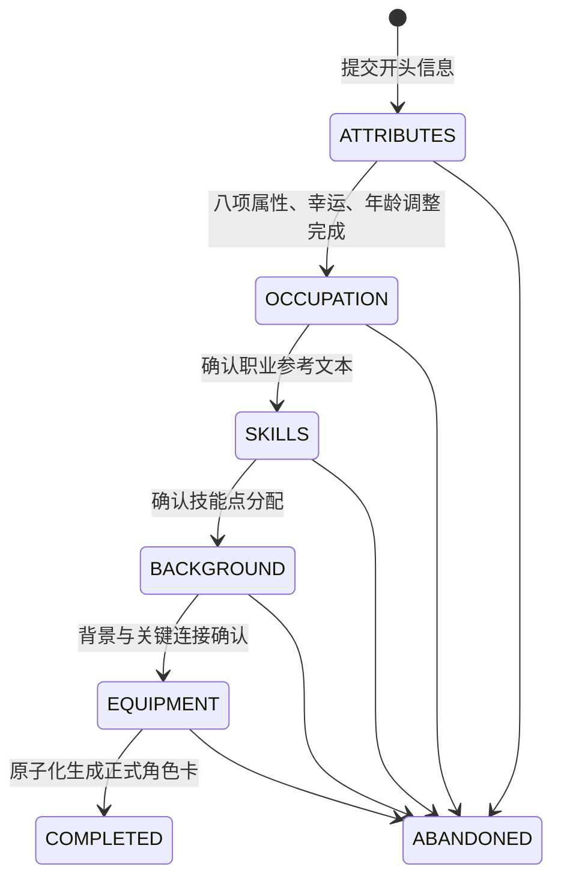

# 步进创建角色卡 API 设计

## 1. 目标与范围

在现有文本导入接口 `POST /character-cards` 之外，新增一套可暂停、恢复、按指定顺序推进的调查员创建流程。

本设计只定义接口、状态、校验和数据边界，不包含实现代码。属性投掷、年龄调整、背景和装备顺序以《第3章 创建调查员》的标准创建法为准；技能分配按项目现有导入接口的宽松总上限执行。属性购点、快速开始、分配属性位置等替代方案不在第一版范围内。

完成后的角色卡继续使用现有 `coc_character`、`coc_character_skill`、`coc_character_weapon`、`coc_character_profile` 和 `CharacterCardVO`，因此后续查询、PDF 输出、聊天与群聊不需要增加第二套角色卡模型。

## 2. 关键设计决定

### 2.1 身份信息前置，但不改变规则步骤

用户要求在流程开头填写：姓名、职业、年龄、性别、住地、出身。它被定义为不编号的“创建前信息”页，之后的编号步骤仍按第三章执行：

1. 生成属性
2. 决定职业
3. 选择技能并分配技能点
4. 创造背景
5. 决定装备

职业是开头填写的自由文本，只用于角色描述和后续背景书写参考。属性生成完成后，第二步仅展示并确认这段职业文本，不计算职业点、不加载职业技能列表，也不限制后续技能选择。这同时满足“开头填写职业”和“属性之后决定职业”的页面顺序。

### 2.2 `participantId` 是角色模板 id

沿用现有导入接口的命名和含义：

- `participantId` 有值：为该角色模板创建卡。服务端读取 `character_template`，自动填写 `playerName = template.name`、`image = template.image`、`actorType = BOT`。
- `participantId` 为 `null`：为当前登录玩家创建卡。服务端自动填写 `playerName = user_info.username`、`image = null`、`actorType = PLAYER`。
- 请求体不接受 `playerName` 和 `image`，避免冒充其他玩家或角色。
- 这里的 `participantId` 不是最终 `coc_character.id`；最终角色卡 id 只有完成流程后才产生。

创建和完成时都必须校验：当前用户拥有 `runId` 对应的用户世界；有 `participantId` 时，该角色模板必须属于此用户世界关联的世界模板。

### 2.3 草稿与正式角色卡分离

开始流程时只创建“角色卡创建草稿”，不提前插入 `coc_character`。原因是：

- 半成品不会被查询、PDF、聊天或群聊误用。
- 放弃或过期不会留下残缺角色卡。
- 不会过早占用现有 `(run_id, participant_id)` / 玩家卡唯一约束。
- 最终完成可以在一个数据库事务中生成整张角色卡。

### 2.4 服务端是随机数和进度的唯一事实源

- 客户端只发“投下一项”的命令，不上传骰点或属性结果。
- 每个随机接口必须带 `requestId`，同一次请求重试返回第一次的结果，不会重复投骰。
- 服务端根据 `nextAction` 校验顺序；不能跳步、倒序或由客户端直接修改已绑定结果。
- 属性不允许单项重投。若采用第三章“重新开始”的可选方案，应放弃整个草稿后新建；第一版不提供该可选方案的快捷接口。
- 背景表按第三章允许在当前类别内重投，但每次结果都保留审计记录。

### 2.5 复用导入规则，但不复制导入接口的缺陷

现有导入实现的技能规则是：

- 技能基础值来自 `coc_skill_def`；`闪避 = DEX / 2`，`母语 = EDU`。
- 新建角色卡的克苏鲁神话必须为 0。
- 当前宽松总上限为 `EDU×2 + INT×2 + 八项属性最高值×2`。

步进流程直接使用上述宽松技能规则，不区分本职点和兴趣点，不按职业限制技能，不校验职业对应的信用评级区间。职业只保存在 `coc_character.occupation` 中作为参考文本。

现有导入解析器的“八项属性总和不得超过 460”来自属性购点思路，不适用于标准随机生成。步进流程不得使用该总和限制；合法骰点即使总和超过 460 也必须接受。

## 3. 状态机与页面顺序

草稿状态：

- `IN_PROGRESS`
- `COMPLETED`
- `ABANDONED`
- `EXPIRED`

规则步骤 `currentStep`：

- `ATTRIBUTES`
- `OCCUPATION`
- `SKILLS`
- `BACKGROUND`
- `EQUIPMENT`

`nextAction` 是比步骤更细的服务端指令。客户端只根据它启用当前按钮。



技术上的预览不新增“第六步”；装备页可以直接展示完整预览并完成，以保持第三章五步顺序。

## 4. 第一步：生成属性

### 4.1 固定投掷顺序

服务端严格按第三章正文中的属性出现顺序推进：

| 顺序 | 属性 | 公式 | 原始范围 |
|---:|---|---|---:|
| 1 | STR | `3D6 * 5` | 15-90 |
| 2 | CON | `3D6 * 5` | 15-90 |
| 3 | SIZ | `(2D6 + 6) * 5` | 40-90 |
| 4 | DEX | `3D6 * 5` | 15-90 |
| 5 | APP | `3D6 * 5` | 15-90 |
| 6 | INT | `(2D6 + 6) * 5` | 40-90 |
| 7 | POW | `3D6 * 5` | 15-90 |
| 8 | EDU | `(2D6 + 6) * 5` | 40-90 |
| 9 | LUCK | `3D6 * 5` | 15-90 |

年龄已在创建前信息中确定，所以 15-19 岁的幸运由同一次接口投两次 `3D6 * 5`，返回两个结果并绑定较高值。其他年龄只投一次。

八项属性、幸运和年龄调整全部完成后，服务端自动计算：

- 每项属性的半值和五分之一值，均向下取整。
- `SAN = POW`。
- `MP = floor(POW / 5)`。
- `HP = floor((CON + SIZ) / 10)`。
- 伤害加值和体格，使用第三章表 1。
- MOV，先比较年龄调整后的 STR、DEX、SIZ，再应用年龄减值。

### 4.2 年龄调整

年龄允许 15-90。年龄 90 按快速参考中的 `80+` 档处理。

| 年龄 | 调整 |
|---|---|
| 15-19 | `strPenalty + sizPenalty = 5`；EDU 减 5；幸运投两次取高 |
| 20-39 | EDU 成长判定 1 次 |
| 40-49 | STR/CON/DEX 合计减 5；APP 减 5；EDU 成长判定 2 次 |
| 50-59 | STR/CON/DEX 合计减 10；APP 减 10；EDU 成长判定 3 次 |
| 60-69 | STR/CON/DEX 合计减 20；APP 减 15；EDU 成长判定 4 次 |
| 70-79 | STR/CON/DEX 合计减 40；APP 减 20；EDU 成长判定 4 次 |
| 80-90 | STR/CON/DEX 合计减 80；APP 减 25；EDU 成长判定 4 次 |

物理减值由玩家分配，各项减值必须为非负整数且合计准确。属性不能被扣成负数；固定 APP/EDU 减值最低到 0。如果 STR/CON/DEX 的可扣总值不足以承受年龄减值，服务端返回 `AGE_ADJUSTMENT_IMPOSSIBLE`，该草稿不能继续，玩家需重新开始。该边界必须明确处理，不能产生负属性。

每次 EDU 成长判定单独调用：

1. 投 `1D100`。
2. 结果大于当前 EDU 时再投 `1D10`，EDU 增加该结果，最高 99。
3. 下一次成长判定使用已经更新的 EDU。

第三章示例中“EDU 84 × 4 = 366”是算术笔误；接口必须返回 336，不能把示例笔误编码为规则。

## 5. 第二步：决定职业

职业不需要目录、职业 code、职业点公式、信用评级区间或技能槽。开始页提交任意非空职业文本，例如“记者”“乡村医生”“退役水手”或“无业”。

进入第二步时，接口只回显开始页填写的职业，玩家可以修改并确认。确认后职业文本锁定并进入技能步骤；职业内容不会改变技能预算，也不会形成技能白名单。

### 5.1 技能标识

接口使用 `skillDefId`，不用展示文本作为主键。这样可以消除现有数据中的 `艺术/手艺` 与 `艺术和手艺`、`斗殴` 与 `格斗:斗殴` 等命名差异。

对于允许专攻的父技能，提交父 `skillDefId` 与 `specialization`。服务端生成规范化展示名；不能直接向“格斗”“射击”“科学”“操纵”“生存”等父项投入点数。

## 6. 第三步：选择技能并分配技能点

### 6.1 单一技能点池

每个技能行只保存一个分配增量：

```text
finalValue = baseValue + allocatedPoints
```

- 总技能点上限为 `EDU×2 + INT×2 + 八项最终属性最高值×2`。
- `allocatedPoints` 可以投给任意具体技能，不受职业影响。
- 信用评级与其他技能相同，只占用总技能点，不校验职业区间。
- 不能向克苏鲁神话分配点数。
- `baseValue`、半值和五分之一值均由服务端计算。
- 每个增量必须为非负整数，最终值范围为 0-99。
- 不允许通过提交低于基础值的数值反向抵扣总消耗。
- 克苏鲁神话最终值必须为 0。

总消耗按现有导入方式计算：

```text
sum(finalValue - baseValue)
<= EDU*2 + INT*2 + max(STR, CON, SIZ, DEX, APP, INT, POW, EDU)*2
```

技能点可以少用，未使用部分直接放弃；确认时只要求总消耗不超过上限，不要求把点数用完。

正式落库时，`coc_character_skill` 只写入最终值不同于基础值的角色技能覆盖项；未加点的标准技能由 `coc_skill_def` 的固定基础值或属性公式实时解析，不重复落库。玩家选择并加点的专攻和非常规技能仍作为覆盖项写入，父技能本身不落为可投点技能。

## 7. 第四步：创造背景

背景严格按第三章的类别顺序展示和推进：

1. `APPEARANCE` 形象描述：第三章只提供候选词，不投骰；玩家根据 APP 书写。
2. `IDEOLOGY` 思想与信念：投 `1D10`，再书写个性化条目。
3. `SIGNIFICANT_PEOPLE` 重要之人：先投“是谁”`1D10`，再投“为何重要”`1D10`，然后书写并为人物命名。
4. `MEANINGFUL_LOCATION` 意义非凡之地：投 `1D10`，再书写并为地点命名。
5. `TREASURED_POSSESSION` 宝贵之物：投 `1D10`，再书写。
6. `TRAIT` 特质：投 `1D10`，再书写。
7. `KEY_CONNECTION` 关键背景连接：从已经填写的背景条目中选择一项，不投骰。

每一类必须先取得提示再写入文本；写完或明确跳过后才能进入下一类。第三章允许 3-6 项背景，因此：

- 六类都会依次出现。
- 允许跳过类别，但最终必须有 3-6 个非空条目。
- 关键连接必须指向其中一个非空条目。
- 每个条目最多 1000 字；服务端只校验非空和长度，不能把随机表原文自动当作最终个性化条目。
- 当前类别允许重投；重投后旧结果保留在审计记录中，但只有最新结果可用于当前条目。

现有 `coc_character_profile` 已能保存六类文本，但缺少关键连接，应增加 `key_connection_category` 和 `key_connection_text`。

## 8. 第五步：决定装备

装备步骤沿用现有数据能力：

- `equipmentText`：重要物品和装备自由文本。
- `weapons`：可选的结构化武器列表，字段与 `coc_character_weapon` 一致；技能名由已选技能引用，不接受不存在的技能。
- `assetsText`：资产形式自由文本。
- `era`：`1920S` 或 `MODERN`，用于第三章现金和资产表。

当前 `runId` 对应的用户世界没有结构化时代字段，因此第一版在装备步骤明确选择时代，而不把时代塞进开头要求的六个身份输入。若后续用户世界增加时代配置，应自动带入并设为只读。

服务端根据最终信用评级和时代返回并落库 `spendingLevel`、`cash` 和资产金额建议。金额计算必须使用结构化数值完成，最后才格式化到现有字符串字段。装备可以为空，但该步骤必须明确确认后才能完成。

## 9. API

所有响应继续使用项目现有包裹：

```json
{"code": 1, "msg": "success", "data": {}}
```

错误时建议在 `data` 增加稳定的 `errorCode`、当前 `version`、`currentStep` 和 `nextAction`，`msg` 仍保留可读中文。例如：

```json
{
  "code": 0,
  "msg": "当前应先投掷 STR",
  "data": {
    "errorCode": "STEP_ORDER_CONFLICT",
    "version": 3,
    "currentStep": "ATTRIBUTES",
    "nextAction": "ROLL_STR"
  }
}
```

### 9.1 规则元数据

```http
GET /character-card-creation/rules
```

接口返回规则版本、属性投掷顺序、技能目录和背景类别顺序。职业是自由文本，因此没有职业目录接口。

技能和背景规则响应必须包含稳定 id/code，客户端不得硬编码技能基础值或背景表文本。

### 9.2 创建草稿

```http
POST /character-card-creation/drafts
```

请求：

```json
{
  "runId": 101,
  "participantId": 12,
  "name": "哈维·沃尔特斯",
  "occupation": "记者",
  "age": 42,
  "sex": "男",
  "residence": "纽约",
  "birthplace": "波士顿"
}
```

`participantId` 可省略或为 `null`。其他六个开头字段必填；字符串去除首尾空格后长度为 1-255，年龄为 15-90。

响应只展示服务端解析出的玩家信息，不允许客户端指定：

```json
{
  "draftId": 9001,
  "status": "IN_PROGRESS",
  "version": 1,
  "rulesVersion": 1,
  "currentStep": "ATTRIBUTES",
  "nextAction": "ROLL_STR",
  "identity": {
    "runId": 101,
    "participantId": 12,
    "actorType": "BOT",
    "name": "哈维·沃尔特斯",
    "playerName": "记者角色",
    "image": "https://example.com/harvey.png",
    "occupation": "记者",
    "age": 42,
    "sex": "男",
    "residence": "纽约",
    "birthplace": "波士顿"
  }
}
```

同一用户世界、同一参与者同一时间只允许一个 `IN_PROGRESS` 草稿；重复开始时返回已有 `draftId`，而不是静默新建多个草稿。

### 9.3 恢复、修改开头信息和放弃

```http
GET    /character-card-creation/drafts/{draftId}
PATCH  /character-card-creation/drafts/{draftId}/identity
DELETE /character-card-creation/drafts/{draftId}
```

- `GET` 返回完整草稿投影、当前预算和下一动作，客户端刷新后可以恢复。
- 姓名、性别、住地、出身在完成前可改。
- 年龄在第一次属性投掷后锁定。
- 职业文本在职业确认前可改。
- `DELETE` 将状态改为 `ABANDONED`，不物理删除审计记录。

修改接口都携带 `expectedVersion`，版本不一致返回 `DRAFT_VERSION_CONFLICT`。

### 9.4 投属性与幸运

```http
POST /character-card-creation/drafts/{draftId}/attributes/roll
POST /character-card-creation/drafts/{draftId}/luck/roll
```

属性请求：

```json
{
  "attribute": "STR",
  "requestId": "01J...ULID",
  "expectedVersion": 1
}
```

服务端要求 `attribute` 等于当前 `nextAction` 指定项。响应包含公式、每颗骰子、原始结果、已绑定属性、下一动作和新版本。相同 `requestId` 重试必须返回完全相同的骰组与版本结果。

幸运请求只包含 `requestId` 和 `expectedVersion`；15-19 岁响应包含两组骰子及 `selectedResult`。

### 9.5 年龄调整

```http
PUT  /character-card-creation/drafts/{draftId}/age-adjustment
POST /character-card-creation/drafts/{draftId}/education-growth/roll
```

40-49 岁的分配示例：

```json
{
  "strPenalty": 0,
  "conPenalty": 0,
  "dexPenalty": 5,
  "expectedVersion": 10
}
```

15-19 岁只接受 `strPenalty` 和 `sizPenalty`，合计为 5。20-39 岁没有物理减值，客户端不调用 `age-adjustment`。

EDU 成长接口每次只执行一次判定，并返回 `checkRoll`、可选的 `increaseRoll`、`eduBefore`、`eduAfter`、`remainingChecks`、下一动作和版本。

当本年龄段不再有动作时，响应附带所有最终属性和衍生值，并进入 `OCCUPATION`。

### 9.6 确认职业

```http
PUT /character-card-creation/drafts/{draftId}/occupation
```

请求示例：

```json
{
  "occupation": "自由记者",
  "confirmed": true,
  "expectedVersion": 14
}
```

`occupation` 为非空自由文本，长度为 1-255。接口不查询职业目录、不计算职业点、不返回职业技能集合；响应返回锁定后的职业文本、总技能点上限，下一步为 `SKILLS`。

### 9.7 保存并确认技能点

```http
PUT  /character-card-creation/drafts/{draftId}/skills
POST /character-card-creation/drafts/{draftId}/skills/confirm
```

`PUT` 是全量替换当前分配，便于客户端滑块回退，不制造逐点写入请求：

```json
{
  "allocations": [
    {"skillDefId": 7, "allocatedPoints": 30},
    {"skillDefId": 18, "allocatedPoints": 55},
    {"skillDefId": 39, "specialization": "油画", "allocatedPoints": 45}
  ],
  "expectedVersion": 15
}
```

响应逐项返回 `baseValue`、`allocatedPoints`、`finalValue`、`halfValue`、`fifthValue`，并返回单一技能点池的 `budget/spent/remaining`。校验失败时整次请求不落任何部分更新。

确认请求：

```json
{
  "expectedVersion": 16
}
```

只要总消耗不超过上限即可确认，不要求用完剩余点数。确认成功后分配被锁定，进入 `BACKGROUND`。

### 9.8 投掷和书写背景

```http
POST /character-card-creation/drafts/{draftId}/background/{category}/roll
PUT  /character-card-creation/drafts/{draftId}/background/{category}
PUT  /character-card-creation/drafts/{draftId}/background/key-connection
```

投掷请求：

```json
{
  "requestId": "01J...ULID",
  "expectedVersion": 20
}
```

返回：

```json
{
  "category": "IDEOLOGY",
  "formula": "1D10",
  "roll": 4,
  "promptCode": "IDEOLOGY_04",
  "prompt": "相信命运……",
  "nextAction": "WRITE_IDEOLOGY",
  "version": 21
}
```

重要之人的第一次调用返回 `SIGNIFICANT_PERSON_WHO`，第二次调用返回 `SIGNIFICANT_PERSON_REASON`。其他随机类别各调用一次；形象描述和关键连接不调用投掷接口。

书写请求：

```json
{
  "text": "我相信命运，并把每一次偶遇都视为征兆。",
  "expectedVersion": 21
}
```

跳过使用同一个 `PUT`，请求 `{"skip": true, ...}`。当前类别的重投仍使用投掷接口，但必须换一个 `requestId` 并显式带 `reroll: true`。

关键连接请求：

```json
{
  "category": "SIGNIFICANT_PEOPLE",
  "expectedVersion": 31
}
```

背景确认后进入 `EQUIPMENT`。

### 9.9 保存装备并完成

```http
PUT  /character-card-creation/drafts/{draftId}/equipment
POST /character-card-creation/drafts/{draftId}/complete
```

装备请求示例：

```json
{
  "era": "1920S",
  "equipmentText": "笔记本\n钢笔\n幸运硬币",
  "assetsText": "一套出租公寓",
  "weapons": [],
  "confirmed": true,
  "expectedVersion": 32
}
```

完成请求：

```json
{
  "requestId": "01J...ULID",
  "expectedVersion": 33
}
```

完成接口在同一事务中：

1. 对草稿加行锁并校验所有步骤已确认。
2. 再次校验用户世界、参与者归属和正式角色卡唯一性。
3. 重新计算属性衍生值、技能基础值、预算、信用评级、资产，不信任草稿中的派生缓存。
4. 插入 `coc_character`，其中 `creation_method = STEP`，幸运写入已投结果。
5. 插入完整技能、武器和背景。
6. 把草稿置为 `COMPLETED` 并记录 `result_character_id`。
7. 返回与导入接口相同的 `CharacterCardVO`。

相同 `requestId` 重试返回已创建的同一张角色卡。完成后再次调用任何修改接口均返回 `DRAFT_ALREADY_COMPLETED`。

## 10. 草稿查询投影

所有修改接口都返回同一种摘要投影，`GET draft` 返回它的完整版：

```json
{
  "draftId": 9001,
  "status": "IN_PROGRESS",
  "version": 21,
  "rulesVersion": 1,
  "currentStep": "BACKGROUND",
  "nextAction": "WRITE_IDEOLOGY",
  "identity": {},
  "attributes": {
    "raw": {},
    "ageAdjustment": {},
    "final": {},
    "derived": {},
    "luck": 55
  },
  "occupation": {},
  "skills": {
    "budget": 508,
    "spent": 430,
    "remaining": 78,
    "items": []
  },
  "background": {},
  "equipment": {},
  "canComplete": false,
  "resultCharacterId": null,
  "expiresAt": "2026-07-22T12:00:00+08:00"
}
```

客户端不应根据本地表单自行推导下一步、预算或最终值。

## 11. 数据设计

### 11.1 创建草稿

建议新增 `coc_character_creation_draft`：

| 字段 | 说明 |
|---|---|
| `id` | 草稿 id |
| `owner_user_id` | 草稿所有者 |
| `run_id` | 用户世界 id |
| `participant_id` | 可空角色模板 id |
| `status` | 草稿状态 |
| `current_step` | 当前五步之一 |
| `next_action` | 当前细动作 |
| `version` | 乐观锁版本 |
| `rules_version` | 创建时绑定的规则版本 |
| `state_jsonb` | 身份、原始/最终属性、职业文本、技能分配、背景、装备 |
| `result_character_id` | 完成后正式角色卡 id |
| `created_at/updated_at/expires_at` | 生命周期 |

`state_jsonb` 需要 DTO 和 `formatVersion`，不能直接序列化 PO。规则版本在草稿期间固定，避免后台更新技能基础值或背景随机表后让进行中的草稿发生漂移。

为 `IN_PROGRESS` 建立两组部分唯一索引：

- `participant_id IS NOT NULL`：`(run_id, participant_id)` 唯一。
- 玩家草稿：`(run_id, owner_user_id)` 唯一。

建议草稿 7 天无操作后置为 `EXPIRED`；读取过期草稿时返回可识别错误，不自动恢复。

### 11.2 投骰审计

建议新增 `coc_character_creation_roll`：

| 字段 | 说明 |
|---|---|
| `draft_id` | 所属草稿 |
| `roll_key` | 如 `ATTRIBUTE_STR`、`EDU_GROWTH_2_CHECK`、`IDEOLOGY_1` |
| `attempt` | 同背景类别重投次数；属性固定为 1 |
| `formula` | 服务端公式 |
| `result_jsonb` | 完整骰子模块与选中结果 |
| `request_id` | 幂等键 |
| `is_current` | 背景重投后的当前结果 |
| `created_at` | 时间 |

唯一约束至少包括 `(draft_id, request_id)` 和 `(draft_id, roll_key, attempt)`。

### 11.3 正式背景扩展

`coc_character_profile` 增加：

- `key_connection_category VARCHAR(50)`
- `key_connection_text TEXT`

草稿的骰子提示和历史不必复制到正式角色卡；正式卡只保存玩家最终书写的背景。

## 12. 并发、幂等与安全

- 每个草稿修改请求都使用 `expectedVersion`；SQL 更新条件包含旧版本并执行 `version = version + 1`。
- 每个随机或完成请求都使用长度不超过 100 的 `requestId`；先查询幂等记录，再执行动作。
- 同一 `requestId` 携带不同参数时返回 `IDEMPOTENCY_KEY_REUSED`。
- 完成接口使用草稿行锁和正式角色卡唯一索引共同防重。
- 所有草稿读取和修改都按 `owner_user_id = 当前用户` 校验，不因知道草稿 id 而可访问。
- 所有文字字段在后端做长度限制；输出按普通文本处理，不接受 HTML。
- 骰子公式完全来自规则目录，客户端不能提交任意公式调用 `DiceUtils`。
- 参与者归属不能只查 `character_template.id`，还要核对模板 `world_id` 与 `runId` 指向的世界模板一致。

## 13. 与现有接口的兼容关系

- `POST /character-cards`：保持文本导入语义和请求结构不变。
- `POST /character-cards/{id}/luck`：导入卡仍可在创建后绑定幸运；步进卡在完成前已经绑定幸运，调用该接口会继续得到“幸运值已绑定”。
- `GET /character-cards/{id}` 与按 `runId/participantId` 查询：无变化。
- `CharacterCardVO`：只因 `CocCharacterProfile` 增加关键连接字段而向后兼容地多两个字段。
- 公共规则应从 `CharacterCardServiceImpl` 中提取为无导入/步进偏好的规则服务；导入和步进完成都调用同一套基础值、衍生值和最终技能兜底校验，避免以后两条路径发生规则漂移。

## 14. 验收标准

1. 开始页严格要求姓名、职业、年龄、性别、住地、出身，并只读展示自动解析出的玩家。
2. `participantId` 有值和无值时，分别正确使用角色模板名称与登录用户名。
3. 八项属性只能按 STR、CON、SIZ、DEX、APP、INT、POW、EDU 顺序各投一次；乱序请求被拒绝。
4. 15-19 岁幸运投两次取高；所有年龄档的扣减、EDU 成长次数和 MOV 调整正确。
5. 随机生成的八项属性总和超过 460 时仍可继续。
6. 同一个 `requestId` 重试不会改变任何骰点。
7. 职业不产生职业点或技能限制；所有分配只校验总消耗不超过 `EDU×2 + INT×2 + 最高属性×2`，且克苏鲁神话保持为 0。
8. `闪避`、`母语`和固定基础值都由服务端回填；客户端不能用低于基础值的值抵扣消耗。
9. 背景依次为形象、思想、重要之人两次投骰、地点、物品、特质、关键连接；最终有 3-6 条且关键连接有效。
10. 未确认装备不能完成；完成后 `creation_method = STEP`，返回现有 `CharacterCardVO`。
11. 完成的事务中任一插入失败时不产生半张正式角色卡，草稿仍可重试。
12. 重复完成、并发完成和网络超时重试最终只产生一张角色卡。
13. 无权访问的 `runId`、不属于该世界的 `participantId`、他人的草稿全部被拒绝。
14. 现有文本导入、查询、删除、PDF 和幸运接口的回归测试全部通过。
