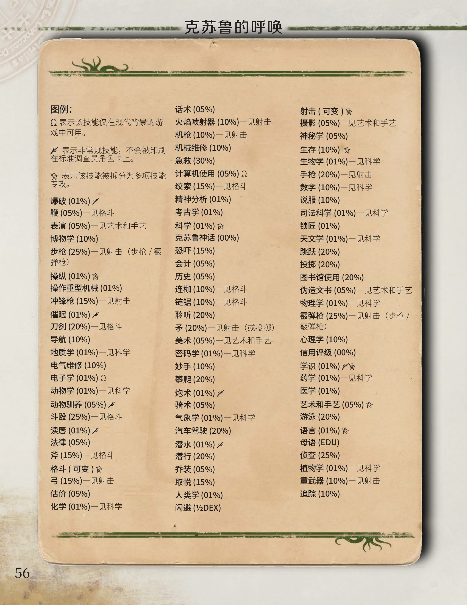

# 第4章 技能

> 来源：PDF 第 65-92 页（书内页约 52-79）

<!-- PDF页 65；书内页 52 -->

> 神秘的事物之间会相互吸引。自打我以魔术表演者的身份声名鹊起之后，我经历了一系列怪异事件，人们总是把我的职业与业余兴趣联系起来。在这些事件中，有些琐碎而无关紧要，有些充满戏剧性而引人入胜，有些带来离奇而危险的经历，而另有一些使我醉身于科学和历史的研究当中。
>
> -- H.P. 洛夫克拉夫特《与法老同囚》

<!-- PDF页 66；书内页 53 -->

> [章节扉页，无正文。]

<!-- PDF页 67；书内页 54 -->

本章将详细介绍技能，定义它们在游戏中的用途和范围。每类技能都包含多种可能性，为确保行文简洁，技能描述将概括性地总结技能的意图及覆盖范围。

## 技能定义

技能表示某一确切时代的知识，一些技能被标为［现代］，这意味着它们只能在现代背景中使用。一些技能被设定为通用名称，在某些背景下可能并不适用；例如，游戏背景是维多利亚时代的伦敦，此时汽车驾驶技能就不适用，在这种情况下，应该将其改写为“马车驾驶”。

技能百分比不是设想中所能掌握的知识的比例。如果能把各自的知识像筹码一样堆在桌子上测量，那么拥有60%技能的现代物理学家所了解的知识，会比1910年90% 技能的物理学家多得多。同样，一些技能会受到地域的影响。在日本，拥有75% 法律技能的日籍调查员想要通过西班牙法律测试，守秘人可能会提高技能检定的难度等级。

一项50% 的技能便足以使角色从中谋生。如果调查员在与自己的职业不相关的技能上变得足够精进，玩家和守秘人可以协商决定赋予该调查员一个新职业。

游戏中发生的特殊情况会要求守秘人对如何使用技能规则做出判断。个别技能下给出了在特定情况下如何使用它们的建议。这些建议用来鼓励守秘人做出自己的判断，而不是翻阅现成的规则。

某些技能包含广泛的知识，如艺术和手艺、格斗、射击以及科学，调查员可以专攻其中的特定领域。

后文详述的一些技能被标记为［非常规］技能，它们不会在标准调查员角色卡上出现（包括炮术、爆破、催眠、读唇等）。如果守秘人希望在游戏中加入这些额外技能，或者玩家希望选取它们，就应该了解这一点。守秘人可能会根据游戏背景和时代来引入其他技能；例如，在远未来，发生在外星球上的游戏，各种各样的新技能将被设计出来。

## 技能专攻

一些广泛的技能被拆分为多项技能专攻。玩家可以将技能点分配至任意一项技能专攻，但不能向这些技能本身分配点数。因此，玩家可以在格斗（斗殴）或者格斗（矛）上花费点数，而不能直接把技能点分配给格斗。

对于艺术和手艺、科学以及生存，这些技能涵盖了广泛的专业领域。守秘人应该决定这些技能的某一特定技能专攻是否适用于当前的状况。视具体情况，如果守秘人认为技能专攻与当前状况有足够的重叠部分，则可

通过技能值判断大体能力水平：

01%-05%：外行：完全的门外汉。

06%-19%：新手：只有少量积累的初学者。

20%-49%：业余：拥有一定天赋或是接受过爱好者水平的初步训练。

50%-74%：职业：角色可以依靠这项技能谋生。相当于某一学科的学士学位。

75%-89%：专家：拥有大量专业知识。相当于硕士或博士学位。

90%+：大师：世界上最精于此道的人之一。

以允许调查员使用另一项专攻来代替原本的专攻进行检定，但难度等级将会更高。

在技能专攻之间，一些技巧和知识往往是共通的。在本章末尾，你可以找到一条关于可转移的技能优势的可选规则。

调查员正在尝试破解一串暗码。守秘人要求进行密码学技能检定。一名没有密码学的玩家询问能否使用数学技能来代替。守秘人同意他以更高的难度等级进行检定。当使用密码学时只需要取得常规成功（掷骰结果小于等于技能值）；而使用数学时需要取得困难成功（掷骰结果小于等于技能的半值）。

对立技能/ 难度等级

每项技能都列出了哪些技能与之对立（如果有），还给出了该技能何时构成常规及困难难度等级的建议。常规难度（需要掷骰结果小于等于技能值）是默认的检定方式。当事情明显变得更加困难时，可能会用到困难难度（需要掷骰结果小于等于技能的半值）。只有在最极端、最严峻的状况下才会用到极限难度（需要掷骰结

<!-- PDF页 68；书内页 55 -->

每项技能后都提供了如何进行“孤注一掷”的示例

哈维正在修理一台涡轮发电机

果小于等于技能的五分之一值）。有些时候，这些难度等级的应用可能只是因为技能的施展受到了极大阻碍，例如调查员正在被射击或被追赶时，又或者情况极为恶劣时。

可能构成极限难度的示例：

爆破：拆除一个前所未见的爆炸装置，它的设计与任何以往所见都截然不同，该装置可能来自未来或是异星。

电气维修：使用某种以未来或异星科技驱动的电子设备。

聆听：在极其嘈杂的环境下偷听一段小声的对话。

锁匠：只用一根铁丝（即没有工具）打开高安全性的锁；打开最内安全的银行金库。

医学：诊断并治疗奇特、新型或异星疾病。

心理学：面对对立技能（恐吓、话术、说服或取悦）达到90%或更高的人，推测对方的意图或判断其是否撒谎。

孤注一掷

（孤注一掷细则见第84页），以及孤注一掷失败的可能后果。这些示例应该被单纯的视为建议。进行孤注一掷的理由范围很广，最好根据游戏中的行动、动机和事件来决定。同样的，孤注一掷失败的后果也最好从目前游戏中发生的事件、非玩家角色以及游戏世界中汲取灵感。

同时，还提供了范例说明疯狂的调查员孤注一掷失败的可能后果，以便在适当时使用。事实上，让疯狂期间的调查员进行行动会使检定的风险显著增加，因为他们孤注一掷失败的后果往往会更加极端（或诡异）。

这些示例仅仅提供一些点子，旨在让玩家和守秘人根据他们的游戏风格来自行设计孤注一掷的理由和其失败的后果。

组合技能检定

一些情况下，守秘人会要求对多于一项的技能进行检定。只进行一次掷骰，将掷骰结果同时与每个被指定的技能进行对比。守秘人将说明两项技能是否都要成功，还是其中一项成功即可。

一位疯狂的邪教徒突然举枪对准哈维。寸秘人要求哈维进行侦查检定或心理学检定。任何一项检定的成功都能让哈维预料到攻击者的行动，还可以给予哈维一个先发制人的机会。成功的侦查检定会让他注意到邪教徒拔枪的动作，而成功的心理学检定会让哈维察觉到邪教徒的攻击意图。

之后，哈维试图修理一台涡轮发电机。这台设备同时具有机械和电气结构，因此守秘人要求进行机械维修与电气维修的组合检定。进行一次掷骰，将结果同时与两项技能进行对比--在这种情况下，两项技能必须都成功才能实现目标。

要注意后一个例子中只掷骰一次的重要性。哈维的机械维修和电气维修技能都只有 10%。当他掷骰一次并将掷骰结果同时与两项技能相对比时，他的成功率为10%。而如果他连续掷骰两次，将两次的掷骰结果分别与机械维修和电气维修对比的话，他两次都成功的概率将降低至 1%。

<!-- PDF页 69；书内页 56 -->

## 技能列表

图例：

话术（05%）

52 表示该技能仅在现代背景的游

火焰喷射器（10%）一见射击

戏中可用。

机枪（10%）一见射击机械维修（10%）

- 表示非常规技能，不会被印刷在标准调查员角色卡上。

急救（30%）

计算机使用 （05%）

- 表示该技能被拆分为多项技能专攻。

绞索（15%）一见格斗精神分析（01%）

爆破（01%）片

考古学（01%）

鞭（05%）一见格斗

表演（05%）一见艺术和手艺

科学（01%）  
克苏鲁神话（00%）

博物学（10%）

步枪（25%）一见射击（步枪 /霰

恐吓（15%）

弹枪）

会计（05%）

操纵 （01%）食

历史（05%）

操作重型机械（01%）

连枷（10%）一见格斗

冲锋枪（15%）一见射击

链锯（10%）一见格斗

催眠（01%）火

聆听（20%）

刀剑（20%）一见格斗

矛（20%）一见射击（或投掷）

导航（10%）

美术（05%）一见艺术和手艺

地质学（01%）一见科学

密码学（01%）一见科学

电气维修（10%）

妙手（10%）

电子学 （01%） 2

攀爬（20%）

动物学（01%） 见科学

炮术（01%）y

动物驯养（05%）火

骑术（05%）

斗殴（25%）一见格斗

气象学（01%）一见科学

读唇（01%）火

汽车驾驶（20%）

法律（05%）

潜水（01%）片

斧（15%）一见格斗

潜行（20%）

格斗（可变）食

乔装（05%）

弓（15%）一见射击

取悦（15%）

估价 （05%）

人类学（01%）

化学（01%）一见科学

闪避（½DEX）

射击（可变）食

摄影（05%）一见艺术和手艺神秘学（05%）生存（10%）生物学（01%）一见科学手枪（20%）一见射击数学（10%）一见科学说服（10%）司法科学（01%）一见科学锁匠（01%）天文学（01%） 见科学跳跃（20%）投掷（20%）图书馆使用（20%）伪造文书（05%）一见艺术和手艺物理学（01%）一见科学霰弹枪（25%）一见射击（步枪/霰弹枪）心理学（10%）信用评级（00%）学识（01%）y药学（01%）一见科学医学（01%）艺术和手艺（05%）游泳（20%）语言（01%）母语（EDU）侦查（25%）植物学（01%）一见科学重武器（10%）一见射击追踪（10%）

原页版式核对图（表格、分栏或图示）

<!-- PDF页 70；书内页 57 -->

孤注一掷示例：花费更长的时间来检查栖息地；品尝未知的蘑菇或植物以便了解它们；向村落的年长者询问当

这项技能可以让使用者安全地进行爆破工作，包括

爆破101%）［非常规］

设置及解除炸药。地雷及类似装置的设计易于布置（无需进行检定）但难于解除。

这项技能同样也包括对军用爆破物的使用（人员杀伤地雷、塑胶炸药等）。

只要有充足的时间和资源，精通爆破者可以利用炸药拆除建筑物、清理堵塞的隧道，也可以重设爆炸装置（制造小当量炸弹、布置诡雷等）。

对立技能/难度等级：

- 常规难度：解除一个爆炸装置；在拆除一座桥梁或建筑时，判断炸药的最佳放置点。

- 困难难度：在有限的时间内解除爆炸装置。

孤注一掷示例：尝试解除引信直到最后一秒；仔细检查每一条电路或连线。孤注一掷失败的范例后果：如果使用爆破技能解除爆炸装置，孤注一掷失败的后果相当明显----它会爆炸！而如果在布置炸药，则孤注一掷失败的后果可能是炸药未能在正确的时间引爆（或根本没有引爆），或爆炸效果未能达到预期（过强或过弱）。

如果陷入疯狂的调查员在孤注一掷中失败，他将设计出最离奇的方式来运送炸药，比如将它绑在猫背上或自己身上。

博物学（10%）

这项技能最初代表对自然环境中的动物及植物的研究。到十九世纪，这些研究分化为多种学科（生物学、植物学等）。作为一项技能，博物学代表来自农夫、渔民以及业余研究者或爱好者们的传统知识（而非科学）与个人观察。它可以用于大略地辨识动植物的物种、习性和栖息地，识别动物或乌类的踪迹与叫声，并能够猜测对于特定物种而言何种行为最为重要。若要科学而系统地了解自然界，请参见生物学、植物学和动物学技能。

博物学（带来的线索）可能不甚精准--它是有关欣赏、辨别、民间传统以及热衷事物的领域。博物学可以用来辨别集市上的马肉，或是判断一件蝴蝶标本是品质出众还是只有装裱精美。

对立技能/难度等级：

- 常规难度：辨识一个特定物种；回忆一些常识；知晓捕鱼的最佳位置。

- 困难难度：辨识一件不同寻常的标本；寻找一种稀有的植物或动物；回忆非常晦涩的事实或传说。

地野生动物。孤注一掷失败的范例后果：你花费了数个小时痴迷地翻阅书籍来辦识物种；你搞错了事实，黄蜂并没有被混合草药的沼泽泥驱散，反而被你吸引了过去（结果十分痛苦）；你吃下了错误的蘑菇，数小时后，你发现自己正赤身裸体地走向警察。

如果陷入疯狂的调查员在孤注一掷中失败，他将投身大自然并迷失于荒野，直到朋友们赶来救助。

操纵（专攻）（01%）

这项技能相当于水上或空中的汽车驾驶，用于操纵飞行或水上载具。你可以花费技能点来购买任意技能专攻，但不能直接向“操纵”技能投入点数。调查员可以在角色卡的空白处填写该技能的数项不同专攻（如操纵飞行器、操纵飞艇等）。每项技能专攻的基础值都为

01%。

任何一位在这项技能上拥有适量点数的角色都可以在风平浪静、能见度良好的情况下航行或飞行，但在暴风雨来临、利用仪器导航、能见度低下或遭遇其他困境时，则需要进行技能检定。恶劣天气、低能见度和破损的载具都可能导致操纵飞行或水上载具的难度等级提高。

对立技能/难度等级：

滅 常规难度：操纵轻型飞机迫降在农田上。

- 困难难度：在极端恶劣的条件下操纵载具（如极端天气、故障的设备）。

孤注一掷示例：拉升飞行器，进行第二次也是最后一次着陆尝试；将载具推上极限；冒险采取激进手段来摆脱追踪者。孤注一掷失败的范例后果：后果应该符合游戏中的情况。可能载具以某种方式受到损坏，必须进行修理才能再次投入使用（在偏远地区可能无法修理）；乘客因操作不当或在事故中受伤；你将飞机迫降到丛林中，醒来时发现自己被绑在大石头上，石头围绕着冒着气泡的巨型煮锅。导致载具化力燃烧的残骸则需要留给更为特殊的情况，如飞行员陷入疯狂时，或是在高速行进中采取异常激进的手段时。

如果陷入疯狂的调查员在孤注一掷中失败，他将相信自己能够做出挑战死亡的特技驾驶，然而他并不能。

<!-- PDF页 71；书内页 58 -->

操纵（飞行器）：理解并愈发精进地操纵下述常规

技能使用者能够引导自愿接受催眠的角色进入恍惚

操纵技能专攻

飞行器。在飞行器着陆时，即使是最好的条件下，也需要进行操纵检定。失败的后果取决于具体情况。风平浪静的夏日，在平坦的草地上降落时，失败的（孤注一掷）操纵检定可能仅仅意味着一次颠簸的着陆，这也许会使脆弱的乘客不敢再乘坐飞机。在极端情况下，如在暴风雨中降落在冰冻的苔原上时，失败的（孤注一掷）操纵检定可能导致飞行器损坏并使所有乘客受伤甚至死亡。失败的检定通常意味着载具受损，必须在下次起飞前进行维修。若在检定中掷出 100，则意味着一场令人难忘的空难。

每一类飞行器都算作不同的技能，应该分别单独列出，或者由守秘人决定。1920s：仅有操纵热气球、操纵飞艇、操纵民用螺旋桨飞机。现代：操纵民用螺旋桨飞机、操纵民用喷气式飞机、操纵民航客机、操纵喷气式战斗机、操纵直升机。操纵技能可以转而用于另一类飞行器，但难度等级可能会提高。

操纵（船舶）：理解小型电机和帆船在风、暴风雨和潮汐中的性能，通过水流和风向来发现水下的障碍物和迫近的暴风雨。在大风中，菜乌水手会发现让船只靠岸十分困难。

操作重型机械101%）

用于驾驶与操作坦克、铲斗机、蒸汽挖掘机或其他大型工程机械。如果角色要操作种类大相径庭且自己并不熟悉的机器，则守秘人可能会提高难度等级，例如：

对于熟练操作推土机的人，无法很快胜任在船上处理轮机室中的蒸汽轮机的工作。

对立技能/难度等级：

- 常规难度：操作起重机或挖掘机。

- 困难难度：操作机器完成精细或特殊的工作，例如开动挖掘机挖出易碎的恐龙蛋而不破坏它们。

孤注一掷示例：按照操作手册的指示一步步进行操作；花费时间来练习；找老师请教。孤注一掷失败的范例后果：驾驶推土机时因为过度自信而失控，使之转向一堵砖墙（这堵墙倒向了你，或者更糟）。

如果陷入疯狂的调查员在孤注一掷中失败，他将相信自己的任务是发掘或建立一座旧日支配者的神殿。

译注：这项技能在角色卡上被简写为“操作重机”。

催眠101%）［非常规1

状态，在此期间，该角色易受暗示诱导、高度放松且被遗忘的记忆可能会被唤醒。催眠的具体范围由守秘人决定，以使其适应游戏设定：可能只有自愿接受的角色才会被催眠，或者守秘人可以允许催眠以更具侵略性的方式对不愿接受催眠的角色使用。

这项技能可以用于对精神创伤者施展催眠疗法，以此缓解恐惧症或躁狂症的影响（成功的催眠意味着目标在某一场景中暂时克服了恐惧症或躁狂症）。一系列成功的催眠疗法可能将某位角色的恐惧症完全治愈（至少1D6次游戏聚会，由守秘人决定）。

对立技能/难度等级：

若对不愿接受催眠的角色使用，这项技能与心理学技能或意志（POW） 属性对立。

孤注一掷示例：使目标的注意力完全集中，以此增加你对目标的影响；使用迷乱的灯光或其他道具来扰乱目标的感官；使用药物使目标更容易受到暗示。孤注一掷失败的范例后果：过去痛苦的记忆或精神创伤被唤醒，使目标损失 1D6 点理智值；目标陷入恍惚，使其之后走向巴士正前方；目标的意识（或调查员的意识）暂时消失，使抱有恶意的存在能够趁虚而入。

如果陷入疯狂的调查员在孤注一掷中失败，他的意识将退化到孩子般的状态，直到接受治疗为止。

导航（10%）

无论是白天还是夜晚，暴风雨还是晴天，这项技能都能用于找到正确的方向。若游戏的时代合适，拥有较高导航技能的角色将会熟悉星历表、海图、导航仪器和卫星定位设备。这项技能同样可以用于测量并绘制一个区域（制图学），无论这个区域是数平方公里的岛屿还是某个房间的内部----使用现代科技进行测绘可以降低甚至取消难度等级。

这项技能的检定可以由守秘人在暗中进行--调查员正在行动，稍后才能知道结果。

若角色熟悉在区域中使用这项技能，检定时可以获得一颗奖励散。

对立技能/难度等级：

- 常规难度：保持正确的行进路线；利用太阳和星辰确定方位；绘制一小块区域的地形图。

- 困难难度：在缺乏明确的路标和地标的情况下，向正确的方向行进；绘制较大区域的复杂地形图。

<!-- PDF页 72；书内页 59 -->

孤注一掷示例：拿出地图，反复确认自己的位置；回到

时间会对制作或维修产生影响，如果时间不受限制，

出发的位置再试一次。孤注一掷失败的范例后果：你迷失了方向，发现自己正在被熊注视甚至被伏击；你在不断兜圈子，你的同伴不再跟随你了（现在只有你一个人了••••••）；你误认了星辰，没能从邪教徒的搜索中逃离，反而回到了邪教的隐蔽据点。

如果陷入疯狂的调查员在孤注一掷中失败，他将扔掉地图（就像《女巫布菜尔》（The Blair Witch Project）中发生的那样）并依靠直觉行进。但他的直觉并没能发挥作用。

电气维修（10%）

使调查员能够修理或重设电气设备，如自动点火器、电动机、保险丝盒与防盗警报等。在现代，这项技能不会被用于电子产品。维修电气设备可能需要特殊的零件或工具。在1920s，这类工作可能需要把电气维修和机械维修结合使用。

电气维修也可以用于现代爆炸物（如雷管、C4塑胶炸药以及地雷）。这类武器的设计易于布置，只有大失败才会让它们哑火（记住检定可以被孤注一掷）。解除爆炸物则要棘手得多，因为它们可能采用了反拆除设计。在解除爆炸物时，需要提高难度等级----见爆破技能。

对立技能/难度等级：

- 常规难度：维修或制造一个普通的电气设备。

- 困难难度：维修一个严重损坏的设备；在没有合适工具的情况下完成工作。

孤注一掷示例：花费更长的时间来维修或重设设备；冒险尝试走捷径。孤注一掷失败的范例后果：因触电而受伤；保险丝被烧毁，建筑陷入了一片黑暗；使设备彻底损坏，无法修复。

如果陷入疯狂的调查员在孤注一掷中失败，他将尝试将生物体的电能引入设备。

电子学110%）I现代］

这项技能用于排查电子设备的故障，并对其进行维修。也可用于制作简单的电子设备。这是一项现代技能--在20世纪20年代，对电子设备的处理以物理学和电气维修进行。

与电气维修技能不同，电子学所需的零件往往无法

临时装配：它们为精密作业而设计。如果没有合适的芯片和电路板，技能使用者就没法完成工作，除非他们能想出变通的方法。

对立技能/难度等级：

特别是角色可以查阅手册并获取零件时，难度等级应该相应降低。

如果调查员拥有合适的配件和说明书，组装普通的电脑甚至不需要进行技能检定。

- 常规难度：维修电脑或电子设备的轻微损坏--这类服务往往在保修期内无偿提供。

- 困难难度：用废弃零件临时组装一个追踪装置，以便将其布置在某人的车里。

孤注一掷示例：花费更长的时间来制作或维修设备；研究新设备或使用其他方法。孤注一掷失败的范例后果：电路或其它精密部件被烧毁；因触电而受伤；造出的设备不符合预期。

如果陷入疯狂的调查员在孤注一掷中失败，他将偏执地相信周围的一切都藏有窃听装置：电话、电视、冰箱。

动物驯养105%）［非常规］指挥并训练动物完成较为简单的任务。这项技能通常用于训犬，但也可能用于鸟、猫、猴子等（由守秘人决定）。对于马或骆驼这类坐骑，则使用骑术技能来训练并控制它们。

对立技能/难度等级：

- 常规难度：命令一只经过训练的狗坐下、取得物品或发起攻击。

- 困难难度：让一只未经训练或不熟悉的狗执行命令。

孤注一掷示例：采取风险更大的行动，靠近或直接接触动物。孤注一掷失败的范例后果：动物攻击了训练师或周围的其他人，通常会使人受伤；动物逃走了。

如果陷入疯狂的调查员在孤注一掷中失败，他将表现的像他尝试控制的动物那样。

读唇101%）［非常规］

这项技能使好奇的调查员能够在不听到谈话者的声音的情况下，知晓他们的对话内容。但说话者必须在视线之内，如果只能看到一位说话者的嘴唇（另一位可能背对着读唇者），那么便只能知晓一半的对话。

读唇也可以用来与另一名角色进行无声的交流（如果双方都精于读唇），并能够理解相对复杂的短语和意图。

<!-- PDF页 73；书内页 60 -->

视具体情况，读唇通常没有对立技能。如果尝试对

格斗技能是角色在近战中使用的技能。你可以花费

对立技能/难度等级：

一名想要保持隐蔽或不被察觉的角色进行读唇，则与对方的潜行技能对立。

滋常规难度：在视线清晰时，读懂距离较近的角色进行的谈话。

- 困难难度：读懂嘴唇不时被遮住的角色进行的谈话，且/或与其距离较远（如在一大群人中）。

孤注一掷示例：在显眼的位置不加掩饰地观察目标；拍摄目标（可能因此被发现正在拍摄）。孤注一掷失败的范例后果：目标察觉到你正在专注地盯着他们，他们感到被冒犯而开始对付你；酒吧对面的醉汉误以为你正在盯着他，向你施以拳头；你太过专注于目标，忽视了身边发生的事（有人偷走了你的东西，或是你撞向了灯柱）。

如果陷入疯狂的调查员在孤注一掷中失败，他将有足够的空间去想象离奇而怪诞的谈话内容。

法律（05%）

代表知晓相关法律、判例、法律辨术与法庭程序的可能性。作为一种职业，从事法律工作可以带来大量回报和政治职位，但这往往需要连续数年的投入--高信用评级对此也很关键。在美国的某些州，律师执业须经过州律师公会许可。

在异国使用这项技能会使难度等级提高，除非该角色花费数月时间研究该国法律制度。

对立技能/难度等级：

- 常规难度：理解并利用相关法条或法律程序的细节。

- 困难难度：记住或理解一个晦涩的判例，或是盘问颇有能力的对方证人。

孤注一掷示例：拖延对手来斟酌论点；详细解释案例或情况的细微差别；花费大量时间进行深入研究；歪曲法条来支持你的论点。孤注一掷失败的范例后果：误解了某条法律，或是超出法律程序认可的范围，导致违法并引起了警方的关注；在研究和法务费用上浪费了宝贵的时间和金钱；由于蔑视法律被关押至少 24小时。

如果陷入疯狂的调查员在孤注一掷中失败，他将相信自己凌驾于法律之上。

格斗（专攻）（可变%）

技能点来购买任意技能专攻，但不能直接向“格斗”技能投入点数。选择适合调查员的职业和背景的格斗技能专攻。

以50% 或更高的格斗（斗殴）技能开始游戏的调查员可以选择一种正式训练作为其背景故事的一部分，以此反应其技能水平。格斗的流派多种多样，武术只是精进格斗技能众多方法中的一途。无论是正规的军事训练、武术训练，还是在街头巷尾中的历练，都能使角色学会如何进行格斗。对娴熟的武术家来说，斗殴一词可能显得太过朴实，如果玩家愿意，可以用诸如“空手道”之类的词来替换它。

注意：作为一项战斗技能，格斗不能孤注一掷。格斗技能专攻

斧（15%）：用于较大的伐木斧。手斧则可以使用斗殴技能。如果投掷斧子，使用投掷技能。

斗殴（25%）：包括所有形式的徒手格斗，以及任何人都能轻易使用的基本武器，如棍棒（乃至板球棒或棒球棍）、刀具、以及各种临时武器，如酒瓶和椅子腿。为了决定这些临时武器所能造成的伤害，守秘人应该参考武器列表中与之类似的武器。

链锯（10%）：世界上第一款以汽油为动力且大批量生产的链锯出现于1927年。不过，也有早期版本的链锯存在。

连枷（10%）：用于双截棍、钉头槌及与之类似的中世纪武器。

绞索（15%）：以长度足够的任意材料进行绞喉。受害者需要使用战技来逃脱，否则每轮将受到 1D6 点伤害。

矛（20%）：用于长矛和刺枪。如果投矛，使用投掷技能。

刀剑（20%）：用于所有长度超过半米的利刃。

鞭（05%）：用于流星索和长鞭。

注意：投掷小刀使用投掷技能。武器及其使用的技能在表17：武器列表（第401-405页）中列出。上述技能专攻可能不包含所有的武器，但如果可以，应该尝试将其他武器纳入上述类别之一。由于链锯在许多电影中都被使用过，所以它作为一种武器被包含在其中。但玩家应该注意，使用链锯时，大失败的概率将会翻倍。一旦大失败，链锯可能杀死调查员或使其失去肢体。

<!-- PDF页 74；书内页 61 -->

估价 （05%）

用于鉴定某一特定物品的价值、品质，及其使用的材料和工艺。如有需要，技能使用者能够确认物品的时代，评估其历史价值，并判断其真赝。

对立技能/难度等级：

滋常规难度：鉴定以普通材料制成，且制造时并不罕见的物品（例如50年前制造的金表）。

滋困难难度：鉴定不同寻常的，以罕见材料制成的物品（例如数百年前国外制作的物品，像是一本古籍）。

孤注一掷示例：与某位专家一同鉴定；设计试验来检测物品；对物品进行系统性的研究。

悦技能。

孤注一掷失败的范例后果：意外导致物品损毁；物品引起了他人的注意，导致其失窃；无意间启动了这件物品的功能。

如果陷入疯狂的调查员在孤注一掷中失败，他将因为相信手上的物品是诅咒之物而将之摧毁；或者将这件物品视为自己的救赎而拒绝将之交给任何人。

话术（05%）

话术的范围限于语言诡计、欺诈和误导，例如哄骗保安使其允许你进入俱乐部、让某人在一份他还未读过的表单上签字、让警察去查看相反的方向等等。这项技能与心理学或话术技能对立。经过短暂的时间之后（通常是在话术使用者离开场景后），目标就会意识到他们受骗了。话术的效果总是十分短暂，但如果取得了更高的成功等级，这个效果便可以持续更长的时间。

话术可以用来对商品或服务进行砍价。如果成功，卖家会暂时认为这桩生意还不错；但如果买家之后想要在此购买另一件物品，卖家可能拒绝进一步议价，甚至可能抬高价格来弥补之前的损失。

对立技能/难度等级：

见取悦、话术、恐吓和说服技能难度等级，第93页。

孤注一掷示例：亲身接近对方；花言巧语来迷惑对方。

这项技能是话术。如果调查员选择其他方式进行交涉，守秘人可以要求使用不同的技能进行检定。如果威

## 社交技能：解析

取悦、话术、恐吓及说服技能的点数有助于定义一个角色如何与他人进行互动。

玩家不能指定自己的调查员在特定情况下使用以上哪项技能。相反，玩家应该描述他们的调查员在说什么、做什么，然后由守秘人决定使用何种技能更为恰当。

- 如果调查员以暴力相威胁，或是采取侵略性行动，则使用恐吓技能。

- 如果调查员尝试与对方交朋友，或是诱惑对方，则使用取

- 如果调查员理性地进行长时间辩论，则使用说服技能。

- 如果调查员迅速误导、哄骗或欺骗对方，则使用话术技能。

当社交技能用于玩家角色

在游戏里，每位玩家通常只扮演一位调查员；因此，允许一位玩家指挥另一位玩家的调查员是不公平的。如果一位玩家想要给另一位玩家的调查员施加压力，要求对方服从命令，则他可能会诉诸暴力（战斗规则）或使用其社交技能。前者可能会对角色造成伤害乃至死亡，而后者则更为巧妙。

当这四项技能之一被成功地作用于一位调查员时（无论技能由NPC还是另一位调查员使用），玩家不必遵循对方的意愿。如果玩家拒绝按照胁迫者的意愿行事，胁迫者可以对被胁迫的调查员的一次检定（由胁迫者选择）施加一颗惩罚骰。这颗惩罚骰不必立即应用在下一次检定中，但也不能无限期推迟。每个角色每次只能持有一颗向其他角色施加的惩罚骰。

胁对方，则可能使用恐吓技能；如果进行长时间辩论，则可能使用说服技能。从一项技能换到另一项技能进行第二次检定仍算作孤注一掷。孤注一掷失败的范例后果：目标受到极大冒犯，招致暴力、愤怒或刑事指控。

如果陷入疯狂的调查员在孤注一掷中失败，他将开始肆意辱骂所有人。

<!-- PDF页 75；书内页 62 -->

急救（且只有急救）能够挽救濒死角色的性命，之后他必须接受成功的医学检定，或者住院治疗。因此，

使调查员能够修复一台损环的，或制作一台新的机

机械维修 （10%）

械装置。同样也可用于进行基础的木工与管道工工作，以及构建（如滑轮系统）与修复（如蒸汽泵）物品。进行这些工作时可能需要特殊的工具或零件。此外，这项技能还可用于打开普通的家庭用锁，但更为复杂的锁需要锁匠技能才能开启。机械维修常与电气维修同时使用，维修汽车或飞机这类复杂设备时可能同时用到这两项技能。

对立技能/难度等级：

- 常规难度：维修或制作简单的装置；打开一把基础的锁。

- 困难难度：维修严重损坏的装置；利用有限的资源制作一个复杂的装置。

孤注一掷示例：将装置完全拆解；花费更长时间进行尝试；冒险用力“敲打”装置以使其运转（如不断拍打某一装置，直到其开始工作）。孤注一掷失败的范例后果：装置彻底损坏，无法修复；在维修装置时伤到了自己（由于割伤了手等）；你痴迷于眼前的装置，不知不觉地在上面花掉了一整天的时间。

如果陷入疯狂的调查员在孤注一掷中失败，他将在电话簿大小的笔记本上写满潦草的设计，最终创造出一台结合有机生命和家用电器的奇异装置。

急救（30%）

技能使用者能够提供紧急医疗处理。这可能包括：

用夹板固定断肢、止血、处理烧伤、救助溺水者、清理及包扎伤口等。急救无法用于治疗疾病（这需要使用医学技能）。

要使急救发挥作用，必须在受伤的一小时内使用这项技能，这可以使伤者回复1点生命值。急救可以尝试一次，之后的尝试则视为孤注一掷。两名角色可以共同进行急救，只要其中任意一人的检定成功即可。成功的急救可以唤醒昏迷的角色。在受到进一步的伤害之前，每名角色只能接受一次成功的急救和医学治疗。

处理濒死的角色时，成功的急救可以在一小时内稳定其伤势，并使其获得1点临时生命值。在这1小时结束和此后的每小时结束时，角色必须进行体质（CON）检定来维持状态，否则（体质检定失败时）角色将再次陷入濒死并失去临时生命值，此后的每一轮中都必须进行体质检定来避免死亡。如果该角色在下一轮中仍然存活，就可以再次尝试对其使用急救（最多由两人同时进行）。这种尝试可以不断进行（不视为孤注一掷），直到其伤势稳定或死亡。

如果你想成为出色的医生，急救和医学技能同样重要。

对立技能/难度等级：

对人类进行的急救总是常规难度。如果对生理构造不熟悉的异星生命进行急救，难度等级将会更高。

孤注一掷示例：花费更长的时间来治疗病人；用风险更大的方法稳定伤势。孤注一掷失败的范例后果：使情况变得更糟，对伤者造成1点额外伤害。

如果陷入疯狂的调查员在孤注一掷中失败，他将认为到自己必须“治愈”面前的伤者，即使这将导致截肢或更糟的情况。实际上，他的行为将对伤者造成损害，如果无人加以制止则可能导致谋杀。

计算机使用105%）［现代1这项技能使调查员能够使用多种计算机语言进行编程；检索并分析晦涩的数据；入侵安全系统；探索复杂的网络；或者检测或进行入侵，发现或利用后门程序和病毒。对计算机系统的特殊操作可能需要进行计算机使用检定。

互联网将海量信息呈现在调查员的指尖下。利用互联网检索具体而/或隐晦的信息可能需要进行计算机使用和图书馆使用组合检定。

浏览互联网、收发电子邮件或运行常规商业软件时，不需要进行计算机使用检定。

对立技能/难度等级：

- 常规难度：编写、分析并调试计算机应用程序。

- 困难难度：在不被发现或追踪的情况下破解并入侵一个安全网络。

孤注一掷示例：花费更多时间来开发应用程序；利用别人的代码作为捷径；使用未经测试的软件（例如病毒）来入侵系统。孤注一掷失败的范例后果：意外删除了重要文件，甚至损坏整个系统；你的操作留下了证据，或是使他人产生警觉；病毒感染了你自己的计算机或网络。

如果陷入疯狂的调查员在孤注一掷中失败，他将迷失在网络空间中，需要物理干预才能让他停止使用电脑或把视线从屏幕上移开。

<!-- PDF页 76；书内页 63 -->

就像盲人引导另一位盲人，疯狂的角色也可以进行精神分析。如果陷入疯狂的角色在孤注一掷中失败，他

这项技能代表一系列心理疗法，而不仅仅是弗洛

精神分析101%）

伊德的精神疗法。尽管其中部分疗法和人类本身一样古老，但正式的精神分析在1890年代还处于早期阶段。在1920年代，精神分析有时会被视为一种欺诈性的研究。研究心理疾病的医师和学者通常被称为精神病学家（alienist）。在现代，成体系的综合疗法逐渐形成，这项技能如今可以被称为心理治疗。

密集的精神分析可以使接受治疗的调查员回复理智值。游戏中每月一次，掷1D100，与精神分析师或医生的精神分析技能相对比，以此确认治疗进展。若检定成功，患者回复1D3点理智值。若检定失败则不回复点数。若检定大失败，患者将失去 1D6点理智，且这位精神分析师的治疗就此终结：治疗过程中发生了严重的事故或戏剧性的挫折，导致医师和患者间的关系破裂，无法挽救。

在游戏中，精神分析本身不能帮助角色从不定性疯狂中恢复，这需要1D6 个月的收容机构（或类似设施）护理，精神分析可能是其中的一部分。

成功的使用这项技能可以让角色暂时克服恐惧症的症状，或是让他们看穿幻觉。在游戏中，这将允许一位陷入疯狂的调查员在短时间内忽略恐惧症或躁狂症的影响，例如让一位幽闭恐惧症患者在狭小的橱柜中躲藏十分钟。同样，角色可以进行精神分析检定来帮助另一名陷入幻觉的调查员暂时看穿其幻觉。

精神治疗师进行的治疗可以帮助角色在不定性疯狂

期间回复理智值（见第八章：理智）。

精神分析无法使角色的理智值回复至99-克苏鲁神话以上。

对立技能/难度等级：

- 常规难度：在医院中进行标准治疗。

- 困难难度：在更长的时间内进行间歇性治疗。

孤注一掷示例：这项技能可以每月都进行尝试而无需孤注一掷。不过，若某个月的检定失败，精神分析师可以在同一次游戏聚会中选择孤注一掷，在游戏中的第二天采取更为激进的手段进行干预。例如：通过使患者正视他们所害怕的事物来迫使其面对恐惧；让患者的朋友和亲密的同事积极地参与治疗。孤注一掷失败的范例后果：将患者关进满是狼蛛的房间，以此治疗患者对 蛛的恐惧，却适得其反，患者陷入了狂乱（可能会对自己或他人造成伤害），并认为自己是“蝴蛛之王”（患者患上新的躁狂症，并造成了额外的理智损失----精神分析师也应该为自己的行为造成的后果进行一次理智检定）。

将试图成为邪教领袖，并将其患者发展为教徒。

考古学 （01%）

鉴别来自古代文明的文物并判断其年代，同时辨别其真赝。还包含建立及勘探考古发掘场的专业知识。通过对发掘场的勘察，技能使用者可以推断出遗址主人生前的状态及生活方式。人类学对此可能会有所帮助。此外，考古学还有助于辨认失传的人类语言的书面形式。

对立技能/难度等级：

- 常规难度：有充足的时间和资源来完成工作。

- 困难难度：缺乏时间且（或）资源有限。

孤注一掷示例：花费更多时间对遗址或物品进行研究；进行深入研究；咨询另一位专家。孤注一掷失败的范例后果：由于操作不当、遭到蓄意破坏或是盗窃，发掘场及考古发现受到损毁；位高权重者从你手中接管了发掘场或考古发现；不当宣传导致考古发现被盗。

如果陷入疯狂的调查员在孤注一掷中失败，他将不断向更深处挖掘----他坚信真相就在其中！

科学1专攻）（01%）

针对某一学科的理论与实践能力，这项技能通常都是通过正式的教育与训练获得，但也可能为学识渊博的业余科学家拥有。对科学的理解与其范围受到时代的限制。你可以花费技能点来购买任意技能专攻，但不能直接向“科学”技能投入点数。

每项专攻都涵盖一个特定学科，下面的列表并未列出所有技能专攻。许多技能专攻之间有着交差重叠的知识，例如数学和密码学、植物学和生物学、化学和药学。如果角色没有相应学科的技能专攻，他可以依照守秘人的判断，以一项与之相关的技能专攻进行检定，但难度等级将会提高（或增加惩罚骰）。

对立技能/难度等级：

- 常规难度：进行实验；回想起所在专业领域中的前沿科学理论；利用合适的设备进行工作。

- 困难难度：进行颇为严苛的实验；解读混乱的或残缺的科学记录；利用临时准备的设备进行工作。

孤注一掷示例：花费更多时间进行学习；进行深入研究（或许在设备更好的实验室）；咨询另一位专家；采取冒险的手段。

<!-- PDF页 77；书内页 64 -->

孤注一掷失败的范例后果：实验出现严重的错误，造成

司法科学（01%）：对证据进行分析和鉴定的学科。通常

了难以预见的损害（爆炸、火灾、被驱逐至第六维度等）；

与犯罪现场调查（检查指纹、DNA、毛发和体液）及实

你错误地准备了魔法粉末的配方，造成了灾难性后果。

如果陷入疯狂的调查员在孤注一掷中失败，他将开始探索其技能专攻中的怪奇技术，最终可能导致如同克劳福德•蒂林哈斯特一般的结果（后者出自洛夫克拉夫特的小说《自外而来》）。

科学技能专攻：

天文学（01%）：技能使用者知晓如何在特定的日期或时间找到天上的恒星和行星，了解日食和流星雨发生的时间，以及重要天体的名称。这项技能还会提供目前已知的有关异星生命、星系的存在或形成的知识。学者能够计算天体的运行轨道，论述恒星的生命周期，而在现代，还包含红外天文学和基线干涉测量的相关知识。

生物学（01%）：研究生命和生物体的学科，包括细胞学、生态学、遗传学、组织学、微生物学及生理学等。使用这项技能可以针对某种可怖的神话病菌研制疫苗，从某种丛林植物中提取致幻成分，或是对血液和/或有机物进行分析。

植物学（01%）：研究植物的学科，包括物种划分、结构、生长、繁殖、化学性质、演化原理、疾病和显微学。植物学的分支学科包括农学、林学、园艺学和古植物学。使用这项技能可以识别特定植物的特性（如是否有毒，能否食用或用于精神治疗）及其特殊用途。

化学（01%）：研究物质的构成，温度、能量和压力对其的影响，以及物质之间的相互反应。化学可以用于创造或提取复杂的化合物，包括简单的炸药、毒药、气体和酸，这需要适当的设备和化学品，并花费至少一天时间。在适当的设备和试剂的帮助下，技能使用者能够分析未知物质。

密码学（01%）：研究暗码和隐语的学科，由个人或多人为隐藏谈话或信息的内容发展而来，属于数学的分支学科。这项技能能够用于识别、创造和/或破译暗码。暗码通常以书面呈现，但也可能以其他形式出现，如将信息隐藏在乐曲、绘画作品或是计算机代码（在现代背景下）中。破译暗码是一项艰苦的工作，通常需要长时间的研究和运算。

工程学（01%）：严格来讲工程学并不算是一门科学，但为方便起见，将其归类于此。科学通过观察和记录来发现某些现象，而工程学将这些发现投入实际应用，如机器、结构及材料。

验室工作有关，以此还原事实并为法律纠纷提供专业证人及证据。

地质学（01%）：用于判断岩层的大致年龄，识别化石的种类，区分矿物和晶体，确认可行的钻井或采矿地点，评估土壤，预测火山活动、地震、雪崩及其他此类现象。

数学（10%）：研究数字和逻辑的学科，包括数学理论、应用、理论解的设计与开发。这项技能可以用于识别非欧几里德几何，解开令人迷惑的公式，解密复杂的图案或暗码（有关暗码的专业研究见密码学）。

气象学（01%）：研究大气的学科，包括天气系统和气候模式，以及大气现象。使用这项技能可以判断气候模式，并预测雨、雪、雾等影响。

药学（01%）：研究化合物及其对生命体的影响的学科。传统上，这项技能设计药物的配方、制取和调配（无论是巫医调配草药还是现代药剂师在实验室中的操作）。这项技能能够确保药物被安全有效地使用，还能使技能使用者知晓药物合成成分，鉴别毒素并了解可能出现的副作用。

物理学（01%）：压力、材料、运动、磁力、电、光、辐射及相关现象的理论知识，并使技能使用者有能力设计实验来验证这些理论。所能掌握的知识取决于时代。实用设备（如汽车）不属于物理学范畴，但实验设备可能属于，并可能需要结合电气维修或机械维修使用。

动物学（01%）：专门研究动物界的生物学学科，包括动物的构造、演化、生物分类、行为习惯和分布，无论是现存的还是已灭绝的物种。使用这项技能可以通过动物留在环境中的痕迹（足迹、粪便、污痕等）来判断动物的物种、可能的行为和领地特征。

克苏鲁神话100%）

这项技能反映角色对非人（洛夫克拉夫特式）的克苏鲁神话的理解。它并非是像学术技能那样的知识积累，而是象征着人类的思维逐渐向克苏鲁神话开放并向其转变的过程。因此，克苏鲁神话技能可以通过遭遇深潜者（或其他神话存在或状况）而获得。克苏鲁神话也被称为“人类不应知晓之事”，它与人类的认知完全相悖，接触它会使人类的心智逐步瓦解。

调查员不能在创建角色时为克苏鲁神话技能分配点数（除非守秘人同意）。调查员角色卡上没有克苏鲁神话技能的选框，因为成功使用这项技能并不会让调查员

<!-- PDF页 78；书内页 65 -->

在该技能上获得提升。作为替代，遭遇神话存在而陷入疯狂，对宇宙本质的疯狂洞悉，以及阅读禁书或其他神

恐吓有多种形式，包括武力震慑、心理操控和威胁。

话著作，都可以使调查员获得克苏鲁神话点数。

一名角色的理智值永远不会超过99减去其克苏鲁神话技能。随着克苏鲁神话点数的增加，理智值会不断受到排挤，让调查员的心智变得更加脆弱。

当发现神话生物的足迹或其他证据时，一个成功的克苏鲁神话技能检定可以让调查员识别出该神话存在，推断其行为或猜测其特性。成功的克苏鲁神话技能检定还可以使调查员回想起一些关于神话的真相，通过目睹施法来识别法术，回想起一道特定法术，或法术的相关信息记载在哪本神话典籍里，又或是完成其他行动。此外，克苏鲁神话技能还可以用来实现某些类似法术的效果。

对立技能/难度等级：

这项技能的基础值为零，且通常保持在较低的水平。绝大多数检定都会在常规难度下进行。

- 常规难度：根据次要证据（足迹、伤口、第一手资料）来识别某一神话存在。

- 困难难度：根据谣言、传说或最低限度的证据来识别某一神话存在；结合深入研究和切身经历来发现神话生物可能存在的弱点，或找到能创造少量优势的方法。

孤注一掷示例：更加靠近生物从而更好地观察；查阅骇人的典籍，或是询问精于此道的人类（或其他智者）；进行尸检以了解更多；回顾这些奇怪的密文时将其大声朗读出来。孤注一掷失败的范例后果：太过接近使自己受到伤害或怀疑；大声阅读典籍时不小心激活了一道召唤法术；无意间损坏或摧毁了正在研究的证据。

如果陷入疯狂的调查员在孤注一掷中失败，他将承受幻象或启示，展现一段关于克苏鲁神话的真相，这与疯狂洞悉类似（可能会获得克苏鲁神话点数并/或受到理智损失）----见疯狂洞悉，第169页。

恐吓 （15%）

恐吓技能可用于惊吓或强迫对方以某种方式行动。这项技能与恐吓或心理学技能对立。

使用武器或其他有利道具协助进行恐吓可以使难度等级降低。若恐吓的孤注一掷失败，可能导致的后果是将威胁的内容付诸实施，造成超出预期的恶劣结果。

恐吓可以用来对商品或服务进行砍价。如果成功，卖家可能会降低价格，或免费奉上物品，但卖家之后可能会向警方或当地黑帮检举此事，视情况而定。

对立技能/难度等级：

见取悦、话术、恐吓和说服技能：难度等级，第93页。

孤注一掷示例：对目标或目标关心的人或事物造成了实质损害。

这项技能是恐吓。如果调查员选择其他方式进行交涉，守秘人可以要求使用不同的技能进行检定。如果收回威胁，转而尝试和对方交朋友，则可能使用取悦技能；如果进行持久而不含威胁的辩论，则可能使用说服技能。从一项技能换到另一项技能进行第二次检定仍算作孤注一掷。孤注一掷失败的范例后果：用枪在目标眼前挥舞时意外地扣动了扳机；目标的精神崩溃，开始做出暴力行为或毫无意义的絮叨；无论你做什么，目

标都只向你投以嘲笑；目标以某种方式扭转了局面，转而向恐吓者进行恐吓。

重要的是，对恐吓进行孤注一掷意味着将事情推向极限。这可能表示数日的审讯，或者用枪指着脑袋的最后通牒。无论使用何种方式，孤注一掷要么获取所需的情报，要么结束目前的状况。

如果陷入疯狂的调查员在孤注一掷中失败，他将陷入对目标的强烈恐惧，并完全遵从其命令。

<!-- PDF页 79；书内页 66 -->

理解会计工作流程，揭示企业或个人的财务运作情

衡量调查员诠释和理解声音的能力，包括无意中听

会计 （05%）

况。通过翻阅资料，可以发现企业是否欺骗员工，有无抽调资金，是否曾支付行贿或勒索款项，以及实际财务状况是否与账面不符。通过检查会计账簿，可以发现资金从何而来、去往何方（粮食运作、奴隶交易、威士忌经营等），以及这些款项向谁及为何支付。

对立技能/难度等级：

如果有人试图隐瞒某件事，则难度等级取决于此人的会计技能。

- 常规难度：账簿记录完整而全面。

- 困难难度：账簿记录混乱且不完整。

孤注一掷示例：花费更多时间来查阅文件；造访银行或企业印证自己的发现；反复核对账簿中的数据和资料。孤注一掷失败的范例后果：调查员和第三方间的交流使反派阵营察觉到调查员的意图；账簿中最重要的部分损毀或丟失（可能因为疲惫的调查员失手将咖啡洒了上去）。

如果陷入疯狂的调查员在孤注一掷中失败，被发现时他可能已经将部分账簿吃了下去。

历史（05%）

使调查员能够回忆有关某个国家、城市、地区或个人的重要情报。成功的历史检定可以用于辨识先祖所熟悉但如今罕为人知的工具、技术或想法。

对立技能/难度等级：

- 常规难度：回忆相关且有用的信息。

- 困难难度：回忆晦涩、详尽且有用的信息。

孤注一掷示例：花费更多时间进行调查；进行深入研究；咨询另一位专家；花费重金雇佣助手进行为时数月的调查。孤注一掷失败的范例后果：这次交流使对手产生警觉，他们察觉到了你的意图；你得到了错误的情报，这将使你陷入危险；大量时间和金钱浪费在了毫无成果的研究上。

如果陷入疯狂的调查员在孤注一掷中失败，他将坚信自己莫名地迷失于时间之中；或者他开始相信自己生活在某个历史时代，衣着打扮言行举止都表现得像是古代人。

聆听（20%）

见的对话、门后的轻声交谈与咖啡厅里的低声私语。守秘人可以用它来确定一场即将来临的遭遇如何发展：你的调查员能否被树枝折断的声音惊醒？换言之，较高的聆听技能表明角色拥有出众的警觉性。

对立技能/难度等级：

当有人悄悄接近你时，聆听与潜行技能对立。

- 常规难度：察觉到有东西正在接近（其潜行技能低于50）；偷听附近的谈话。

- 困难难度：察觉到有东西正在接近（其潜行技能在50到89之间）；偷听小声的谈话。

孤注一掷示例：静止不动，仔细聆听；靠近声音的来源（如把耳朵贴在火车轨道或是门上）；让在场的人保持安静（自己制造响声出来），然后仔细聆听。孤注一掷失败的范例后果：那个“东西”让你措手不及（你被突袭）；你错听了谈话的内容，把事情弄混了；你的偷听行为被发现，情况变得非常尴尬。

如果陷入疯狂的调查员在孤注一掷中失败，他将对所有的声音异常敏感，若是没有耳塞或类似的东西就无法自制。

妙手105%）

使技能使用者能够利用杂物、布、其他遮蔽物或是使人产生错觉的道具（如使用暗板或隔层），来对某件或某些物体进行视觉上的遮挡、藏匿或掩盖。越大的物体就越难以隐藏。

此外，妙手可用于盗窃、掌中藏牌和在暗中使用手机。

对立技能/难度等级：

妙手通常与侦查技能对立。根据物体的尺寸来调整难度等级。如果要将可以放入口袋或袖子的小物件藏于掌中或隐藏起来，则不需要调整难度。如果物体较大，难度等级可能提高。

- 常规难度：对侦查技能低于50%的角色进行盗窃。

- 困难难度：对侦查技能在50%到 89%之间的角色进行盗窃。

孤注一掷示例：花费更多时间观察目标及其行为；接触或冲撞目标；在夹克里布置精心设计的机关来隐藏卡牌或灌铅的骰子；分散对方的注意力。

<!-- PDF页 80；书内页 67 -->

孤注一掷失败的范例后果：你发现警察将手搭在了你肩上；虽然没有人能证明你偷走了那颗价值连城的钻石，

- 常规难度：火炮维护良好，且在有利条件下使用。

但已经有人对你起了疑心，你开始察觉到最近的一周一直被神秘的黑影所跟踪；你被当场抓获，歹徒对盗贼从不手软！他们将你带走，并用几支棒球棍狠狠地教训了你。

如果陷入疯狂的调查员在孤注一掷中失败，他将表现的像患上了盗窃癖。

攀爬 （20%）

这项技能可以使角色借助或不借助绳索与攀爬工具的情况下，攀登树木、墙壁或其他垂直平面。同时该技能还可用于绳索垂降。

墙面的牢固程度、抓握处的多寡、风、能见度、雨等情况都会影响检定难度。

如果初次检定失败，表示此次攀爬可能超出了调查员的能力范围。在孤注一掷中失败则可能表示调查员失手跌落并因此受伤。一次成功的攀爬检定就能让调查员在几乎所有情况下完成攀爬（而不是进行多次检定）。更具挑战或距离更长的攀爬应该具有更高的难度等级。

对立技能/难度等级：

- 常规难度：抓握处充足；有绳索或是排水管可供攀爬

- 困难难度：抓握处很少，或者表面被雨水打湿。

孤注一掷示例：重新评估此次攀爬；选取一条更长的路线；竭尽全力进行攀爬。孤注一掷失败的范例后果：跌落并受到伤害（跌落在草地上每3米1D6 点伤害，在混凝土上每3米1D10点伤害）；一件贵重物品从口袋里掉落（可能之后才发现）；被困在半空中，无法向上或向下移动。

如果陷入疯狂的调查员在孤注一掷中失败，他将尽可能保住性命并发出声嘶力竭的尖叫。

炮术101%）［非常规1

这项技能表示某种形式的军事训练和经历。技能使用者拥有操作战争武器的经验：能够在小队或“分遣队”中，以远超单兵武器射程的距离投射弹药。许多这类武器对于操作人员来说过于庞大，没有小队的帮助下无法操作，或者应该提高检定的难度（由守秘人根据所用武器的类型进行判断）。

根据游戏的时代背景，这项技能会有多种不同的技能专攻，包括加农炮、榴弹炮、迫击炮和火箭发射器。

对立技能/难度等级：

- 困难难度：火炮维护不良，或在移动并/或受到攻击时使用。

注意：作为一项战斗技能，炮术不能孤注一掷。

骑术（05%）

这项技能用于骑乘驯马、驴或骡子，并包含有关坐骑的基本护理、骑乘用具以及驭使坐骑疾驰或越过困难地形的知识。如果坐骑意外地抬起身子或被绊倒，骑手保持骑行的概率等于其骑术技能值。侧鞍会使难度等级提高一级。不熟悉的坐骑（如骆驼）也有可能顺利驾驭，但难度等级将会提高。

如果调查员从坐骑上摔落，无论是因为坐骑倒下、摔倒或死亡（或是因为骑术的孤注一掷失败），这次意外会使调查员损失至少1D6 点生命值----但成功的跳跃检定可以抵消这一伤害。

对立技能/难度等级：

对坐骑下达基本的指令，或是以步行的速度骑乘坐骑不需要进行检定。

- 常规难度：高速驰骋；稳住受惊的坐骑。

- 困难难度：在天气恶劣的情况下驾驭坐骑在崎岖而陌生的地形上高速行进（如在大雨倾盆的夜晚驰骋于繁茂的树林之间）。

孤注一掷示例：鞭策或以其他方式逼迫坐骑，迫使其越过沟壑或深沟；在麻烦逼近时冒险继续骑乘坐骑，而不是从坐骑上跳下来。孤注一掷失败的范例后果：骑手被抛下坐骑，受到跌落伤害；缰绳缠住了骑手的脚，导致骑手被拖行了一段距离。

如果陷入疯狂的调查员在孤注一掷中失败，他将难以自拔地痴迷于坐骑。

汽车驾驶 （20%）

任何具备这项技能的人都能够驾驶轿车或轻型卡车进行常规机动，并处理常见的载具问题。如果调查员想要甩掉追踪者或追踪某个人，那么他可能需要进行一个汽车驾驶检定。

不同的文明可能会用相似的技能替代汽车驾驶：因纽特人可能会使用“雪橇驾驶”，维多利亚人则可能会使用“马车驾驶”。

<!-- PDF页 81；书内页 68 -->

- 困难难度：从专心的守卫犬身旁溜过；只有几秒钟

- 常规难度：在车流间快速穿行，甩掉追踪者。

对立技能/难度等级：

- 困难难度：在拥堵的车流间快速穿行，甩掉追踪者。

孤注一掷示例：将车辆推至极限；冒险不减速过弯。孤注一掷失败的范例后果：发生碰撞；车辆因打滑而失控，无法继续前进；被警察追捕。

如果陷入疯狂的调查员在孤注一掷中失败，他可能会在停下的车子后面不断用嘴模仿引擎的声音。

潜水101%）［非常规1

技能使用者接受过训练，能够使用并维护潜水设备。包括水下导航、计算潜水配重以及对应急程序的了解。

在1942年水肺被发明之前，人们穿着僵硬的潜水服，依靠连接到水面的管道泵入空气来呼吸。

在现代，水肺潜水员会熟悉潜水的物理原理、气压以及利用压缩空气呼吸时的生理过程。

对立技能/难度等级：

- 常规难度：利用维护良好的设备进行常规下潜。

- 困难难度：在危险环境下潜水，或利用维护不良的设备潜水。

孤注一掷示例：将设备推上极限；系统性的复查潜水设备；得到专业人士的帮助。孤注一掷失败的范例后果：被困在水下；被海洋生物袭击；遭受减压症。

如果陷入疯狂的调查员在孤注一掷中失败，他将开始理解鲸歌----你所要做的只有遵从它们的指引。

潜行（20%）

在不被人听到或看到的情况下，安静地进行移动与躲藏的技巧。当角色尝试避免被发现时，玩家应该进行潜行技能检定。这项技能表示角色擅长安静地移动（脚步轻盈）和/或精于伪装。此外，这项技能还表示角色能够保持一定程度的耐心和冷静，来使自己长时间保持静止，不被发现。

对立技能/难度等级：

尝试躲藏起来时，以对方的侦查技能来设置潜行检定的难度等级。场景也可能对检定难度产生影响（如黑暗或嘈杂的环境）。

- 常规难度：在屋中安静地移动，以避免被普通人发现（其侦查和聆听技能低于 50%）。

时间来寻找藏身之处。

孤注一掷示例：花费更多时间探查这片区域；脱下鞋子；分散对方的注意力；保持潜伏，直到情况明朗。孤注一掷失败的范例后果：你不知道自己已经暴露，邪教徒们并未直接靠近，而是决定召唤“某种东西”来对付你；你藏身的柜子的柜门被上锁，而后彻底钉死。

如果陷入疯狂的调查员在孤注一掷中失败，他将相信自己能够隐形，而事实上每个人都看得到他。

乔装（05%）

当你想让自己看起来像是另一个人的时候，使用这项技能。技能使用者通过改变姿势、服装和/或声音来伪装成另一个人或另一类人。特效化妆和假身份证明会很有帮助。

对立技能/难度等级：

这项技能的使用有着两个不同的方向：一是你试图隐瞒自己的真实身份（如警察在找你的时候），二是你打算冒充其他人。

- 常规难度：让陌生人相信你就是你所假扮的那个人。例如返回前一天的作案现场而不引起注意。

- 困难难度：在会面中让专业人士相信你就是你所假扮的那个人。例如假扮银行职员获准进入银行金库。要注意，与认识被模仿者的人会面，并使其相信你就是你所假扮的那个人，这超出了乔装技能的使用范围，可能需要进行难度更高的组合技能检定（与说服、取悦或话术）。

孤注一掷示例：进行完全沉浸式的准备（使自己完全进入角色）；窃取被模仿者的私人物品，利用其进行伪装；用夸张的手法使对方混淆；假装突然发病来迷惑观察者。孤注一掷失败的范例后果：被逮捕；引起冒犯，招致暴力或刑事指控；发现自己模仿的对象正在被犯罪集团伺机报复。

如果陷入疯狂的调查员在孤注一掷中失败，那么即使拿掉伪装，他也无法在镜中认出自己的脸。取悦（15%）取悦包含多种形式，包括以外貌吸引、诱惑、奉承或仅仅是依靠个人魅力。取悦技能可用于迫使对方以某种方式行动，但不可能使其做出完全与平日作风相反的行为。这项技能与取悦或心理学技能对立。

取悦可以用来对商品或服务进行砍价。如果成功，卖家就会被说服，从而同意降低一些价格。

<!-- PDF页 82；书内页 69 -->

见取悦、话术、恐吓和说服技能：难度等级，第93页。

这项技能使调查员能够本能地躲避击打与投掷物

对立技能/难度等级：

孤注一掷示例：深情地公然奉承对方；赠送昂贵的礼物；吐露秘密来换取信任。

这些都算作取悦。如果调查员选择其他方式进行交涉，守秘人可以要求使用不同的技能进行检定。如果威胁对方，则可能使用恐吓技能；如果进行长时间辩论，则可能使用说服技能。从一项技能换到另一项技能进行第二次检定仍算作孤注一掷。孤注一掷失败的范例后果：目标受到冒犯，不再与你进行进一步交流；目标和你的敌人有某种联系，尽管他们暂时与你合作，但他们随时都可能告发你；第三者出面阻止你继续与他们的姑娘搭讪。

如果陷入疯狂的调查员在孤注一掷中失败，他会神魂颠倒地爱上对方，仿佛对方成功地对其施放了支配术

（见第十二章：法术）。

人类学 （01%）

通过观察来辨识并理解一个人的生活方式。如果技能使用者在一段时间内观察另一种文化，或者研究某一已灭绝文化的准确记录，那么即使证据可能不完整，也可以对该文化的生活方式及状态做出简单的预测。研究某一文化一个月或更久，人类学家便能开始理解该文化如何运转，结合心理学，就可以预测被研究者们的行为和信仰。

对立技能/难度等级：

这项技能的难度取决于技能使用者与研究对象之间的接触程度。

- 常规难度：花费一个月或更多时间接触研究对象。

- 困难难度：只花一个星期或更少的时间接触研究对象。

孤注一掷示例：花费更多时间来研究目标；花上一段时间融入当地的“风土人情”；在仪式、典礼上发挥积极作用。孤注一掷失败的范例后果：由于违反当地法律或社会习俗，研究者被研究对象攻击或监禁；研究者参加了一场涉及服用精神药物的仪式，产生了严重的副作用。

如果陷入疯狂的调查员在孤注一掷中失败，他将迷失于正在研究的文化之中，就像丹尼斯 •霍珀在《现代启示录》（Apocalypse Now）中扮演的摄影记者那样。

闪避（1/2DEX%）

等。角色可以在一个战斗轮内闪避任意次数（但针对每一次攻击只能闪避一次；见第六章：战斗）。和其他技能一样，闪避可以通过积累经验而获得提升。只要攻击能被看见，角色就可以试图闪避它。因此，子弹无法被闪避，因为它在飞行过程中几乎无法被看见，角色对此能做出的最佳的反应即是做出规避动作以使自己更难被击中（即“寻找掩护”）。

对立技能/难度等级：

闪避技能主要在战斗中作为对抗检定的一部分使用，因此不设置难度等级。

注意：作为一项战斗技能，闪避不能孤注一掷。

射击（专攻）（可变%）

包括所有类型的枪械，以及弓和弩。你可以花费技能点来购买任意技能专攻，但不能直接向“射击”技能投入点数。选择适合调查员的职业和背景的射击技能专攻。

注意：作为一项战斗技能，射击不能孤注一掷。射击技能专攻

弓（15%）：用于弓和弩，包括中世纪长弓到现代高性能复合弓。

手枪（20%）：用于所有手枪类武器，进行非连续性射击。现代全自动手枪（MAC-11、UZI 微型冲锋枪等）则使用冲锋枪技能进行射击。

重武器（10%）：用于榴弹发射器、反坦克火箭等。

火焰喷射器（10%）：喷射易燃液体或气体的武器。可由操作者携带或安装于载具上。

机枪（10%）：架设在两脚架或三脚架上，能够进行全自动射击的武器。如果以架设于两脚架的此类武器进行单发射击，则使用步枪技能。如今，突击步枪、冲锋枪和轻机枪之间差异已经不甚明显。步枪 / 霰弹枪（25%）：用于所有类型的步枪（无论是杠杆式、栓式还是半自动步枪）及霰弹枪。由于霰弹枪的弹药以散射方式击发，使用者的命中目标的概率不会随着射程增加而降低，但造成的伤害会因此减少。此外，以突击步枪进行单发射击（或多次单发射击）时，使用该技能。

冲锋枪（15%）：用于所有全自动手枪和冲锋枪，也可用于全自动模式的突击步枪。

枪械在表17：武器列表（第401-405页）中列出。

<!-- PDF页 83；书内页 70 -->

如果陷入疯狂的调查员在孤注一掷中失败，他将表现出某种形式的痴迷：或许调查员会将神秘学符号纹在

技能使用者能够辨识神秘学用具、词汇与概念以及

神秘学（05%）

民俗传统。还可用于辨认魔法书与神秘学记号。神秘学家熟知家族间代代相传的神秘学知识，这些知识可能来自埃及和苏美尔，中世纪和西方文艺复兴时期，也可能来自亚洲和非洲。

阅读某些书籍可以使神秘学技能获得提升。尽管旧日支配者的崇拜者们经常使用神秘学概念，但这项技能无法用于克苏鲁神话中的法术、书籍以及魔法。

在游戏中，守秘人将决定非神话魔法是真实存在的还是虚构的（见第九章：魔法）。

对立技能/难度等级：

- 常规难度：从民间传说或神秘学理论中回忆信息；理解塔罗牌或其他占丶方式的含义。

- 困难难度：辨识稀有的或独特的神秘学典籍；回忆神秘学习俗或仪式的细节。

孤注一掷示例：花费更多时间对现场或物品进行研究；进行深入研究；咨询另一位专家；在仪式开始前沐浴净身，做好万全准备。孤注一掷失败的范例后果：回忆起错误的信息，仪式以错误的方式进行，带来了灾难性后果（如房子被付之一炬）；准备守护之环时使用了错误的成分，使其没能驱走你召唤出的恶灵；你的研究揭开了一道与神话的联系途径，这迄今都不为人所知的发现粉碎了你的思想（造成理智损失）。

脸上和手上，或是在用水晶球占卜出未来之前一直拒绝行动。

生存（专攻）（10%）

这项技能提供在极端环境中生存所需的专业知识，如沙漠或极地环境，以及海洋或荒野地带。取决于所处的环境，这项技能可以用于狩猎、搭建庇护所、识别环境危害（例如避开有毒植物）等。

你可以花费技能点来购买任意技能专攻，但不能直接向“生存”技能投入点数。选择这项技能时，应选择专攻的环境，如生存（沙漠）、（海洋）、（极地）等。如果角色没有明显与当前状况对应的生存技能专攻，他可以依照守秘人的判断，以一项与之相关的技能专攻项进行检定，但难度等级将会提高（或增加惩罚骰）。

对立技能/难度等级：

根据当时的情况与所处的环境，或角色没有相应技能专攻时，难度等级会有所调整。

- 常规难度：寻找或搭建一处庇护所；找到水和食物来源。

- 困难难度：在天气恶劣或身受重伤时进行以上行动。

孤注一掷示例：冒险进行一些尝试（如直接饮用未经净化的水；食用未经确认的浆果）；使用所有的衣服来改造庇护所；投入所有的物品来燃起烽火。孤注一掷失败的范例后果：你找到的洞穴里住着一头愤怒的熊；你烧光了所有的衣服来燃起烽火，将位置暴露给了追踪者----救援人员能在追踪者找到你之前抵达吗？

如果陷入疯狂的调查员在孤注一掷中失败，他将相信自己超脱自然，只依靠呼吸就能生存（而不需要水和食物）。

说服（10%）

通过合理的论证、论辩与讨论使对方相信某一特定想法、概念或信念。说服的内容可能并非事实。成功的说服需要花费至少半个小时的时间。如果你想要迅速地劝服对方，则应当使用话术技能。这项技能与恐吓或心理学技能对立。

根据玩家所表达的内容，如果调查员在说服目标上花费了足够多的时间，说服的效果可能会无限期的延续

下去：可能会持续数年时间，直到发生事件或另一次说服转变目标的想法。

<!-- PDF页 84；书内页 71 -->

说服可以用来对商品或服务进行砍价。如果成功，

孤注一掷失败的范例后果：锁具损坏，无法修复（可能由于开锁器断在了锁里）；你破坏了机关盒（可能只有

卖家就会完全相信这桩生意非常划算。

对立技能/难度等级：

见取悦、话术、恐吓和说服技能：难度等级，第93页。

孤注一掷示例：接近对方，以私人化方式论证你的论点或反驳对方的观点；利用精心设计的心理暗示（或是依靠潜意识说服）来让对方尽可能接受你的观点；举办一场盛大的演出（表演、焰火、礼品、免费的酒水、贿赂等），来把你的观点推向台前的一大群人。

这项技能是说服。如果调查员选择其他方式进行交涉，守秘人可以要求使用不同的技能进行检定。如果威胁对方，则可能使用恐吓技能；如果尝试和对方交朋友，则可能使用取悦技能。从一项技能换到另一项技能进行第二次检定仍算作孤注一掷。孤注一掷失败的范例后果：目标受到极大冒犯，不再与你进行进一步交流；你的贿赂奏效了，对方签署了表单--但在寒冷的晨光中，他意识到自己被骗了，现在他的律师雇佣了私家侦探来调查你，或是起诉你的不法行为；对方不喜欢你的高谈阔论，向你掏出了不知从何而来的刀子；你说服安保人员对你的盗窃行为睁一只眼闭一只眼--这使其失去了工作，并且因为内疚而自杀（你的行动带来的后果对你造成了打击，由于造成无辜者死亡，你将因此承受理智损失）。

如果陷入疯狂的调查员在孤注一掷中失败，在街角被发现时，他正在说服路人相信他的论点，或向其灌输离奇的观点。

锁匠101%）

锁匠可用于打开车门、短路点火（发动引擎）、撬开图书馆的窗户、破解中国机关盒或越过普通的警报系统。技能使用者可以借助万能钥匙、开锁器和其他工具来修复锁具、配钥匙或是开锁。特别难以破解的锁可能需要更高的难度等级。

对立技能/难度等级：

- 常规难度：打开或修理普通的锁。

- 困难难度：打开安全性较高的锁。

孤注一掷示例：将锁完全拆解下来；花费更长时间进行尝试；用力撬动其中的机械结构。

砸碎一途能打开它）；你触发了警报，或是发出了足够大的噪音让什么人或什么东西上前查看⋯•如果陷入疯狂的调查员在孤注一掷中失败，他将放弃锁具，转而寻求解放自己的思想；现实的面纱在他眼前揭开，他将用一种全新的方式看待这个世界，但对任何心智健全的人来说，这一切毫无意义。

跳跃（20%）

成功的跳跃检定可以使调查员垂直跳起或跳下，或者沿水平方向立定或助跑跳远。坠落时，跳跃可以用来降低跌落所带来的伤害。

在检定前，需要对当前状况构成常规跳跃、困难跳跃还是极限跳跃做出判断（它们分别对应常规成功、困难成功和极限成功）。作参考，常规成功的跳跃可以使调查员安全地从其身高的高度垂直跳下，或是在水平方向立定跳过长度相当于身高的裂缝，又或是助跑跳过两倍于身高的距离。若取得极限成功，调查员将能够跳过两倍于前述的距离，但需要注意跳远的世界纪录为

8.95米’。

若从高处坠落，成功的跳跃可以让角色对跌落做好准备，从而使跌落伤害减半。

对立技能/难度等级：

- 常规难度：从身高的高度跳下；立定跳过长度等于身高的距离；助跑跳过两倍于身高的距离。

- 困难难度：在常规难度的基础上增加50%的距离或高度；比如从屋顶起跳，越过小巷跳向另一侧建筑上的窗子。

孤注一掷示例：延迟并花些时间来评估此次跳跃；做好充足的准备，集中全身的重量和力气纵身一跃。有些情

况下无法进行孤注一掷：如果角色尝试越过深渊，就不可能进行第二次尝试。不过，如果角色被困在坑里，根要依靠跳跃来逃脱，他可以进行任意次尝试，这些尝试将被总结为一次孤注一掷的跳跃检定。孤注一掷失败的范例后果：跌落并因此受伤；完成了跳跃，但一件有价值的物品（由守秘人选择）在此过程中掉落。

如果陷入疯狂的调查员在孤注一掷中失败，他将坚信自己可以飞翔。1此为1991年创造的男性跳远世界记录；女性跳远世界记录为7.52米（1988年）。

<!-- PDF页 85；书内页 72 -->

投掷物体来击中目标。手掌大小、质地均匀的物体

投掷（20%）

（或任何为投掷设计的武器）可以被掷出力量（STR）除以5米远的距离'。有效射程可以增加至STR除以2米，但投掷检定会因此获得一颗惩罚骰。如果要投掷的物体较重（超过STR除以20千克），则以上射程再除以3（即STR-15米，以及 STR-6米）。

如果投掷检定失败，物体可能落在距离目标一定距离的随机位置。守秘人应该将掷骰结果与所需的值相对比，并为投掷物和目标之间确定一个合理的距离。

在战斗中，投掷技能可用于投掷刀、石头、矛、手榴弹或回力标等。

对立技能/难度等级：

投掷物的重量可能会影响难度等级。此外，投掷非常轻的物体，在顺风情况下投掷也可能影响难度等级。

滋常规难度：把篮球扔进篮筐。

凉困难难度：在稍远的距离精确投掷；中场投篮。一旦物体被投掷出去，他就完全脱离了调查员的掌控，因此玩家没有理由进行孤注一掷。如果有多个投掷物可用，且投掷失败也不会产生风险，那么调查员取得成功只是时间问题，因此无需进行检定。如果有多个投掷物可用，且投掷失败会带来明显的风险，则守秘人可能会要求进行孤注一掷。

孤注一掷示例：花些时间来评估距离，或是等待有利条件；用尽全身力气进行投掷；快速投掷多件物体，以期其中一件能命中目标；带着越过峡谷的劲头进行长距离助跑。孤注一掷失败的范例后果：你将物体投向同伴时，不慎摔倒并跌落，脑袋撞向了凸起的岩石；投掷时用力过猛，物体飞过高高的教堂围墙，向着墓地而去；炸药棒从你手中滑落--你徒劳地寻找，却只闻到了引信燃烧的味道。

如果陷入疯狂的调查员在孤注一掷中失败，他将拒绝放开本应投掷的物体。

图书馆使用（20%）

图书馆使用可以使调查员找到一段信息，例如一份特定的书籍、报纸、图书馆中的参考文献或是整理过的文档或数据库，但前提是这条信息确实可以被找到。使用这项技能意味着需要进行数个小时的持续检索。

1 已进行公制单位转换。原文为STR-5码和 STR-2码（一颗惩罚骰）；物体超过 STR-10磅时，以上单位从码变为英尺。

图书馆使用带来了惊人的线索。这项技能可以用于找到某本被封锁的档案或罕见的珍藏书籍，但要取得它们，可能需要用到说服、话术、取悦、恐吓、信用评级或是特殊的资质文件。

对立技能/难度等级：

- 常规难度：在图书馆中找到一本书或一段信息。

- 困难难度：在杂乱无章的图书馆中找到一段信息；你的时间非常紧迫。

孤注一掷示例：请求图书管理员的帮助；花费更多时间系统地排查书库。孤注一掷失败的范例后果：找到了一本类似的书籍，其中包含误导性信息，这将使调查员陷入危险；与对手红缠--他们可能察觉到了你的调查，并据此采取行动，或是他们检查了你正在寻找的书籍（或撕掉了相关书页）；与图书管理员发生争执，导致图书馆会员资格被吊销。

如果陷入疯狂的调查员在孤注一掷中失败，他将开始收集书籍，裁下书页贴在卧室的墙上，做大量离奇的笔记，用棉线和别针把书页串起来。或者调查员痴迷于寻找正确的书籍或信息，把所有的时间都花在偷书和研究书籍上。

<!-- PDF页 86；书内页 73 -->

从而降低他们的信用评级点数。更多有关信用评级及其应用的规则，见信用评级与调查员开支（第95页）。

所有人都拥有的察言观色的能力，技能使用者能够

心理学（10%）

观察另一个人，从中判断其动机和性格。守秘人可以选择代替玩家暗中进行心理学技能检定，只告知玩家使用该技能所获取的信息，而不告知这一信息的真伪。

对立技能/难度等级：

心理学与各项社交技能对立：恐吓、话术、说服和取悦。此外，它也可以用于看破对方的伪装（如对方使用乔装技能时）。

- 常规难度：面对相关技能（恐吓、话术、说服和取悦）低于50%的人，推测对方的意图或判断其是否撒谎。

- 困难难度：面对相关技能（恐吓、话术、说服和取悦）在50%到89%之间的人，推测对方的意图或判断其是否撒谎。

孤注一掷示例：公然向对方询问私人化、亲密或非常直接的问题；让自己沉浸在对方（你所观察的人）的资料中，以便像对方一样思考并理解其动机。孤注一掷失败的范例后果：你以某种方式向对方透露了自己的动机；对方被你的刺探性的询问或好奇的凝视所冒犯，不在与你进一步交谈，或是采取行动来对付你（施以暴力或是报警）；你不知道的是，对方与你的对手有所联系，而你无意间向其透露了你的日程安排；你花了一整周时间把自己锁在房间里来建立对方的档案，这使你身心俱疲（在恢复之前，你的所有检定都将获得一颗惩罚骰）。

如果陷入疯狂的调查员在孤注一掷中失败，他将确信自己听到了对方的邪恶想法，并对其发动了攻击。

信用评级100%）

这项技能用于衡量调查员的财富与阶级。钱可通神，如果调查员希望利用其钱财来实现某个目标，就应该使用信用评级技能。信用评级可以取代外貌（APP）来确立对角色的第一印象。

相较于技能，信用评级更像是衡量财产的指标，因此它不能像其他技能一样获得成长标记。在游戏中，较高的信用评级会是非常有用的资源，应该在创建调查员时为其分配技能点。每个职业都标有信用评级的起始范围，应该花费技能点来使信用评级达到这个范围。

《克苏鲁的呼唤》并不需要仔细追溯角色花销，但了解调查员的经济能力会十分有用--例如：调查员能否负担雇佣一队考古学家和工人去挖掘一座埃及陵墓的费用？调查员的信用评级会随着时间而发生变化。克苏鲁神话使调查员陷入疯狂，这可能会让他们失去工作，

对立技能/难度等级：

- 常规难度：从银行或企业获得贷款；绕过对证书或资历的要求；在商店或赌场中赊账；在高级餐厅中获得最佳位置。

- 困难难度：在受到刑事调查（或被判有罪）的情况下获得贷款；被媒体中伤后获得有利关注。

孤注一掷示例：你抵押了房子和/或其他贵重物品来从高利贷者手里取得资金；你企图胁迫银行经理放贷。孤注一掷失败的范例后果：高利货者态度恶劣地让他的手下把你教训了一顿；银行经理报了警；你借到了钱，但这个陷阱让你背上了更沉重的债务，一位黑手党计划买断你的债权，好让你帮他做事。

如果陷入疯狂的调查员在孤注一掷中失败，他将失去对资本主义的一切信心，并开始将钱随意分发给路人。

（详见第 95 页的普遍生活水平。）学识（专攻）（01%）［非常规！

这项技能表示角色对一门学识的专业理解，这些学识不属于常见的人类知识体系范畴。学识的技能专攻应该具体而不同寻常，例如：

- 梦境学识滋《死灵之书》学识（如该书的历史）滋 UFO 学识滅 吸血鬼学识燕 狼人学识

- 亚狄斯星人2学识如果守秘人希望测试调查员这些学识中某一领域的了解，但调查员缺乏相关的学识技能专攻时，守秘人可以允许其使用另一项（更普通的）技能来代替，但需要更高的成功等级。例如，如果守秘人希望测试一位现代调查员对20世纪80年代有关外星人绑架的知识，他可以要求他在 UFO 学识上取得常规成功，或是在历史上取得困难成功。此外，学识技能也可以用来让守秘人记录非玩家角色（NPC）所掌握的知识。通常来说，知识表现为教育（EDU） 属性和几项具体的技能，如历史或克苏鲁神话。守秘人应该决定何时将学识技能加入游戏，通常只有特定领域的专业知识成为游戏的核心时才这么做。

2

亚狄斯星出自《穿越银匙之门》。

<!-- PDF页 87；书内页 74 -->

> [全页插图：实验装置中的大脑。无正文。]

<!-- PDF页 88；书内页 75 -->

医学（01%）

诊断并处理事故、伤口、疾病、中毒等等，并能提出公共卫生建议。如果当前时代还未对某一疾病提出对应的治疗方案，这项技能的效果将会十分有限、难以预估或是毫无结果。医学技能使角色掌握各类药物和药剂的知识，无论其是天然的还是人工合成的，还包括对其副作用及禁忌症的了解。

使用医学技能进行治疗需要花费至少一个小时的时间，并且可以在受到伤害后的任意时间进行，但如果没有在受伤后一天内进行，那么检定的难度等级将会提高（需要困难成功）。成功地使用医学技能可以为目标回复1D3点生命值（与其曾通过急救回复的生命值叠加），但濒死的角色除外，他必须先接受一次成功的急救检定来稳定其伤势，其后才能对其使用医学技能。

在受到进一步的伤害之前，每名角色只能接受一次成功的急救和医学治疗（角色濒死时除外，其可能需要多次接受急救来稳定伤势）。成功的医学检定可以唤醒昏迷的角色。

处理重伤时，成功使用医学技能可以为伤者这一周的恢复检定提供一个奖励骰。

在设施完备的当代医院接受治疗时，守秘人可以允许医学检定自动成功。

对立技能/难度等级：

滋常规难度：在合适的环境中，借助设备（至少需要装有药物和器械的医疗包）来诊断并治疗常规疾病。

- 困难难度：在脏乱且不安全的环境中，利用最低限度的设备进行诊断和治疗。

孤注一掷示例：咨询同事；进行深入研究；尝试实验性的或风险更大的疗法；实施某种形式的临床实验。孤注一掷失败的范例后果：你做出了误诊，使病人的病情恶化（甚至可能杀死他们）；你良好的信誉遭到质疑，你将由于治疗失当而被调查。治疗濒死的角色时，若在医学技能上孤注一掷失败会导致伤者死亡。

如果陷入疯狂的调查员在孤注一掷中失败，结果将

异常极端：他将尝试把动物的部分躯体移植给人体，这失败的尝试可能会导致截肢或败血症。

艺术和手艺（专攻）（05%）

调查员角色卡上留有空间用于填写这项技能的技能专攻。例如：“这些象形文字⋯我从未见过…”

- 表演

写作

滋理发

- 莫里斯舞’

- 书法

- 歌剧

瀲木工

滋粉刷

- 烹饪

- 摄影

- 舞蹈

瀲陶艺

- 美术

- 雕刻

滅 伪造文书

- 吹制真空管2

这些示例技能专攻中有许多都与职业直接相关，但它们也可以只是业余爱好。你可以花费技能点来购买任意技能专攻，但不能直接向“艺术/手艺”技能投入点数。

这项技能可以用于制造或修理物品----这通常需要设备和时间，必要时由守秘人决定。在适当的情况下，取得的成功等级越高，制作出的物品品质越好、精度越高适当的艺术/手艺技能专攻同样可以用于制作仿制品或赝品。在这种情况下，难度等级取决于原品的复杂程度和独特性。如果要伪造文档或证明文件，则需要使用特定技能专攻（伪造文书）。1 一种英格兰民俗舞蹈。2 在半导体尚未普及的二十世纪早期，真空管在各类电子设备中有着广泛应用。

<!-- PDF页 89；书内页 76 -->

成功的艺术/手艺检定可以提供某一物品的信息，

放设备、数码照相机和数字剪辑等方面，使摄影师可以

比如它的制作时间、制作地点，有关它的历史或制作工

熟练地处理数字图像。甚至可以在原片的基础上创造完

艺，或者它的制作者是谁。精通该技能某一专攻的角色将在这一领域拥有广泛的知识--知晓该领域的历史，认识它的当代从业者，以及实践它的能力。

对立技能/难度等级：

- 常规难度：制作一件标准的，可供销售的物品。

- 困难难度：制作一件品质更好或非常复杂的物品。

孤注一掷示例：从零开始返工物品、零件或文章；进行深入研究；咨询另一位专家。孤注一掷失败的范例后果：在失败的创作中浪费了大量时间和金钱；观众或顾客因为你的作品而受到严重的冒犯或身体上的伤害；你的工作受到评论家抨击，不再有人需要你的服务了。

如果陷入疯狂的调查员在孤注一掷中失败，他将创造出一件十分过激的作品，会在观众间引发震惊和暴力倾向--也许只有最颓废的人才能欣赏它。示例艺术和手艺技能专攻

表演（05%）：表演者接受过戏剧和/或电影表演训练（在现代，可能也会包括电视表演），能够使其化身为一个角色，背诵剧本，还能依靠化妆来改变自己的样貌。见乔装（第68页）。

美术（05%）：画家擅长绘画艺术（油画、丙烯画、水彩画），以及用铅笔、蜡笔或粉笔进行素描。严肃的作品可能需要数天乃至数月才能被创作出来，但画家可以迅速将印象中的场景、物品和人物勾画出来。这项技能还表示对艺术界的熟悉程度，让画家可以认出特定艺术家的作品、他们的学校以及这件作品的过去。

伪造文书（05%）：伪造者擅长重现细节，能够制作高品质的假文件，模仿他人的字迹，伪造政府部门签发的文件或许可，以及复制一本巨著。伪造者会需要合适的材料（特殊的墨水、高质量的纸张等）以及要复制的原件。

成功的检定意味着伪造出来的文件能够通过正常的粗略检查。花时间彻底查验文件的人将使用其估价技能（与伪造者的伪造文书技能对立）来确定其能否发现文件是伪造的。

摄影（05%）：包括静态及运动摄影，这项技能可用于拍摄清晰的照片、冲洗底片并增强暗部细节。

在1920s，技能使用者能够制备用于制作闪光粉所需的化学品。

在现代，这项技能的范围将扩展至摄像机、视频回

全不同的图像，例如修改某个人在照片中的位置、改变照片里有哪些人以及他们都在做什么。熟练掌握这项技能的人也能发现照片何时被修改过。

拍摄普通的快照不需要进行检定。摄影检定会用于实现有效的抓拍，或是捕捉特定细节--特别是在距离被摄主体较远、被摄者高速移动或在微光环境下拍摄。同时，这项技能还能让调查员确定照片是否遭到篡改或伪造，以及照片的拍摄角度和位置。

游泳（20%）

用于在水或其他液体中漂浮并移动的能力。只有在危机或险境中，或守秘人认为需要时，才进行游泳检定。在游泳的孤注一掷中失败可能会损失生命值，也可能导致该角色被冲向下游、部分或完全溺水。

对立技能/难度等级：

根据当时的情况与所处的环境，难度等级会有所调整。

- 在泳池中游泳：无需检定。

- 常规难度：在急流中游泳。

- 困难难度：穿着衣服在急流中游泳；天气条件恶劣。

孤注一掷示例：深呼吸，用尽所有力气去行动；挑战体能极限。孤注一掷失败的范例后果：你被水淹没，失去了意识，醒来时发现自己身处未知的海滩；水流将你冲走，你撞上岩石而受伤；你奋力游向救生艇，就在成功之时，你感觉水下有什么阴冷湿滑的东西抓住了你的脚踝。

如果陷入疯狂的调查员在孤注一掷中失败，他将不断游动，并认为干燥的陆地是十分危险的。

语言（专攻）（01%）

选择这项技能时，需要指定一门确切的语言，并将其填写至技能后面。一名角色可以掌握任意数量的语言。这项技能的数值代表这名调查员使用这门母语之外的语言进行听、说、读、写的能力。

远古或未知语言（如阿克洛语’、许珀耳玻瑞亚语？等）不能被选择（除非守秘人同意），但可以选择普通的地球语言。如果要识别这门语言的古语或古文，守秘人可能会提高难度等级。一次成功的语言检定通常可以使你能够阅读整本书的内容。1 阿克洛语（Aklo），克苏鲁神话中的虚构语言。2 许珀耳玻瑞亚语（Hyperborean），出自希腊神话，克苏鲁神话作品中亦有引用。

<!-- PDF页 90；书内页 77 -->

滅 5%的技能可以正确的辨识出这门语言而无需检定。

通常使用母语不需要进行检定。即使使用了技术、

关于语言技能的建议

滾 10%的技能可以交流简单的想法。滾 30% 的技能可以理解商务谈话。滾 50%的技能可以流利地使用这门语言。

- 75%的技能就像这门语言的母语者一样。

- 辨识一门当代人类语言（调查员未掌握的），应该进行知识检定。

- 辨识一门已经消失人类语言，应该进行考古学或历史检定。

- 辨识一门异星语言，应该进行克苏鲁神话检定，也可能使用神秘学检定。

对立技能/难度等级：

流利的语言使用者在正常交谈时不需要进行检定。当与不能流利使用这门语言的外国人对话时，可能需要为了使对方理解而稍作停顿。

- 常规难度：交谈（可能语速较快）；阅读包含少量技术或罕见术语的书面材料。

- 困难难度：阅读含有大量罕见技术术语的材料；理解古语；对方有着不寻常的口音。

孤注一掷示例：花费更长的时间来措辞；经过长时间停顿后再做回答；参考书籍进行翻译。孤注一掷失败的范例后果：调查员和第三方间夸张或大声的交流使反派阵营察觉到调查员的意图；一个词或短语被误解（可能颠倒了词义）；无意间的发言冒犯到了对方，其向你回以拳头，或是喊来周围的人对付你。

如果陷入疯狂的调查员在孤注一掷中失败，他将开始用方言讲话，或是想象他们正在使用以诺语。

母语 （EDU%）

选择这项技能时，需要指定一门准确的语言，并将其填写至技能后面。在婴儿及幼儿早期，大多数人仅使用一门语言。玩家需要选择一门语言作为母语，其起始值等于调查员的教育（EDU）属性；此后调查员将以该值或更高的百分比（如果在创建调查员时为母语分配了更多技能点）来使用这门语言进行理解、说话、阅读和写作。

对立技能/难度等级：

古体或深奥的术语，如果双方有意进行交流且有充足的交谈时间，那么大多数事情都应该在不进行检定的情况下完成。

如果一份文档极其难读，或是以某种古体方言写成，守秘人可能要求进行检定。

孤注一掷示例：见前文的语言技能。

侦查（25%）

技能使用者能够发现密门或隔间，注意到藏匿起来的闯入者，发现不明显的线索，辨认重新喷漆的汽车，意识到伏击者，注意到鼓起的口袋，以及各种类似的事物。这项技能对于调查员来说十分重要。

如果角色只有极短的时机发现某些事物，如飞身而过的时候，守秘人可能会选择提高难度等级。如果角色进行彻底的搜索，守秘人可以选择使其检定自动成功。所处的环境也可能影响检定的难度等级----在杂乱的房间里很难我到东西。

对立技能/难度等级：

寻找躲藏起来的角色时，以对方的潜行技能来设置侦查检定的难度等级。

- 常规难度：在房间中寻找检索。

- 困难难度：找到被刻意隐藏的物体。

孤注一掷示例：花费更多时间观察这片区域；划分区域进行搜索；拆卸家具、砸碎瓷像。孤注一掷失败的范例后果：在搜索时无意中丢失了自己的物品，这将证明你曾出现在那里（调查员不会马上意识到这一点）；你没能注意到泥地中的爪印，当野兽红着眼扑向你时，你将受到突袭；当你设法寻找线索时，没有意识到邪教徒已经赶了回来。

如果陷入疯狂的调查员在孤注一掷中失败，他将相信有什么东西隐藏于此，他会尝试在墙纸后面、石膏像中还有地板下面找到它。

<!-- PDF页 91；书内页 78 -->

使用这项技能，调查员能够通过地面或植物上的痕

追踪（10%）

迹来追踪人、载具或动物。诸如痕迹遗留的时间、降雨和地面的类型等因素都可能会影响检定的难度等级。

对立技能/难度等级：

如果要追踪企图隐藏踪迹的人，以对方的潜行技能来设置追踪检定的难度等级；根据当时的天气与地形，难度等级会有所调整。

滋常规难度：在正常（温和）条件下追踪森林中的动物或人类。

困难难度：跟随数天前（或是更久）遗留下来的痕迹。

孤注一掷示例：原路返回并花费更多时间来探查这片区域；进行大规模螺旋式搜索来寻找踪迹（花费更长的时间，可能会制造更多噪音进而暴露自己的位置）。孤注一掷失败的范例后果：你追踪的痕迹将你引向饥饿的熊/狮子/食人族；你发觉自己在不断兜圈子，夜幕将临时，你意识到自己已经完全迷路了；你所追踪的痕迹最终使你受到被追踪者的伏击，或使你受困于其设下的陷阱。

如果陷入疯狂的调查员在孤注一掷中失败，他将无法自制地追踪任何痕迹（他坚信自己的判断），直到他的身体受到拘束或以其他方式被说服。

技能专攻：

可转移的技能优势

技能专攻有以下两种处理方式：

喻 艺术和手艺以及科学技能的处理方式已在第54页的技能专攻中说明。

- 对于格斗、射击、语言（在分类后）和生存技能，各项专攻之间有许多共通之处。例如，在学习使用枪械时，各类枪械的相似之处远多于其差异。在格斗中，战斗者能够使用许多相通的技巧（反应速度、距离判断、规避、佯攻、把握时机、发现空档、知晓要害等等）。与天文学和药学（以科学内例）相比，这些技能专攻之间的差异要小得多。因此，在格斗、射击、语言（在分类后）和生存技能里，一项专攻的精进会为与其密切相关的所有专攻带来可转移的优势。

当一名角色首次将上述技能专攻中的一项提升至

50% 或更高时，所有与之相关的专攻都将提升10点（但不会高于50%）。这种提升只能再发生一次：

当一名角色首次将一项技能专攻提升至90%或更高时，所有与之相关的专攻将再提升10点（但不会高于90%）。在创建调查员的过程中，玩家可以先提升一项专攻来获得其他专攻中的额外10点，再向这些专攻分配更多技能点。

马修花费了25 个技能点，将他的格斗（斗殴）技能提升至50%。格斗技能下的其他所有专攻都将在其基础值上获得额外10点奖励。格斗（刀剑）现在从 30%开始，而非此前的20%。然后马修花费了5个技能点，将格斗（刀剑）提升至35%。在游戏中，马修的调查员抄起一把斧头。马修在格斗（斧）上没有投入任何技能点，但由于他拥有一项50%的格斗技能专精，他使用斧头的成功率从

15% 提升至 25%。

布莱恩在他的格斗（斗殴）上花费了20个技能点，在格斗（斧）上花费25点，在格斗（刀剑）上花费 12点，目前这些技能专攻的成功率为：

斗殴45%，斧45%，刀剑32%。他的格斗（斗殴）技能取得了成长并增加了7点，使其提升至

52%。这会让他的其余技能专攻各提升10点（但不会高于 50%），所以现在他的技能成功率为：

斗殴52%，斧50%，刀剑42%（注意他的斧技能只提升了5点）。

<!-- PDF页 92；书内页 79 -->

语言

当一名角色首次将一门语言（母语除外）提升至

50%时，所有与之相关的同类语言都将提升10点（但不会高于50%）。这种提升只能再发生一次：当一名角色首次将一门语言（母语除外）提升至90%时，所有与之相关的同类语言都将再提升10点（但不会高于

90%）。例如，同类语言包括日耳曼语族（英语、德语、荷兰语等）、斯拉夫语族（俄语、捷克语、波兰语等）、尼日尔-刚果语系（斯瓦希里语、祖鲁语、约鲁巴语等）。

注意，同类语言的详细列表不可能在此处列出，建议使用这条可选规则的守秘人参考百科全书中的“语言系属分类 （Language family）”。

“翻译这东西得花掉我好几个星期。”
